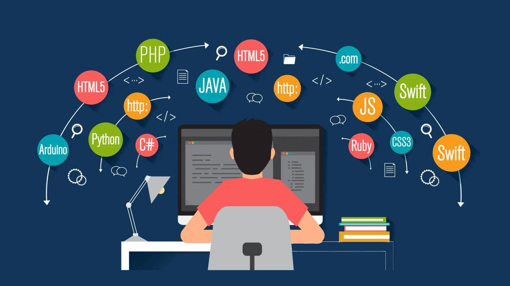

# Notes

    

Bem-vindo ao repositório **Notes**! Aqui, você encontrará uma coleção organizada de anotações sobre ferramentas, tecnologias e boas práticas de desenvolvimento de software. Este repositório é um recurso prático e acessível para quem busca aprendizado e referências rápidas, abrangendo desde fundamentos da programação até tópicos avançados em ciência da computação e engenharia de software.

> Este projeto foi desenvolvido com o framework [Quartz](https://github.com/jackyzha0/quartz).

## Objetivo

Imagine estar perdido em meio ao mar de informações que é o universo da tecnologia. Já me senti assim: um desenvolvedor sedento por conhecimento, mas incapaz de organizar ou reter tudo o que aprendia. Gastava horas procurando soluções para problemas recorrentes, revisitando conceitos que já tinha estudado, mas que se perdiam em anotações espalhadas.

Foi então que decidi transformar minha frustração em motivação. Criei este repositório para centralizar, organizar e compartilhar esse conhecimento de maneira clara e acessível. O "Notes" não é apenas uma coletânea pessoal, é também um convite para você, que talvez esteja enfrentando a mesma dor de se perder no excesso de informações. Aqui você encontra soluções, dicas práticas e insights que podem ajudar a tornar sua jornada mais eficiente e produtiva.

Se você também sente a necessidade de otimizar seu aprendizado, este repositório é para você. Juntos, podemos construir um repositório vivo, que evolui com cada nova contribuição e aprendizado compartilhado.

## Como Navegar

Para uma experiência mais completa, explore a versão web deste projeto. Clique neste [link](https://imgabreuw.github.io/notes/) para acessar uma interface interativa que facilita a navegação e apresenta as anotações de forma mais dinâmica.

## Contribuições

Este repositório está em constante evolução, e contribuições são mais do que bem-vindas! Se você identificar erros, tiver ideias ou desejar adicionar novas informações, sinta-se à vontade para abrir uma issue ou enviar um pull request.

Espero que este repositório seja uma ferramenta útil para você, ajudando a tornar sua jornada de aprendizado mais leve e inspiradora. Boa leitura e happy coding! 🚀

