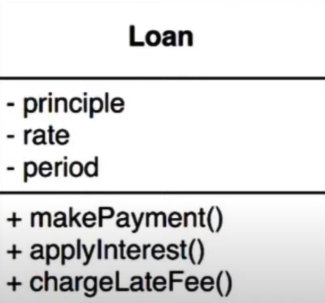

# Conceitos de arquitetura de software

### Regras de negócio

* **Definição** 

  * É a lógica de um sistema, a razão dele existir

  * Deve ser independente de agentes externos (banco de dados, UI, frameworks) -> promove uma maior flexibilidade

* **Exemplo**: função do Gmail é **mandar email**, portanto "mandar email" é a razão dessa aplicação existir (regra de negócio)

### Regras de negócio de domínio

* É a parte mais importante

* É independente de software

  > **Software**: é responsável por automatizar as regras de negócio

* Essa lógica é implementada na entidades de domínio

### Entidade de domínio

* **Definição**: `dados críticos + regras de negócio = entidade`

  * **OBS**: na programação orientada a objetos: `dados críticos = propriedades/atributos` / `regras de negócio = métodos/comportamentos` / `entidade = objeto`

* **Exemplo**

  * **Entidade** = empréstimo

  * **Dados críticos** = valor do empréstimo, taxa de juros, período de pagamento

  * **Regras de negócio** = fazer pagamento, aplicar juros, multar pagamento atrasado 

### Regras de negócio de aplicação

* São regras voláteis, ou seja, podem mudar de aplicação para aplicação

* São operação de alto nível (responsáveis por manipular os objetos de domínio)

* Essa lógica é implementada nos casos de uso (*use cases*)