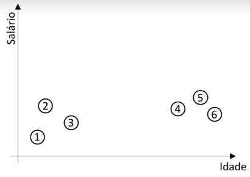
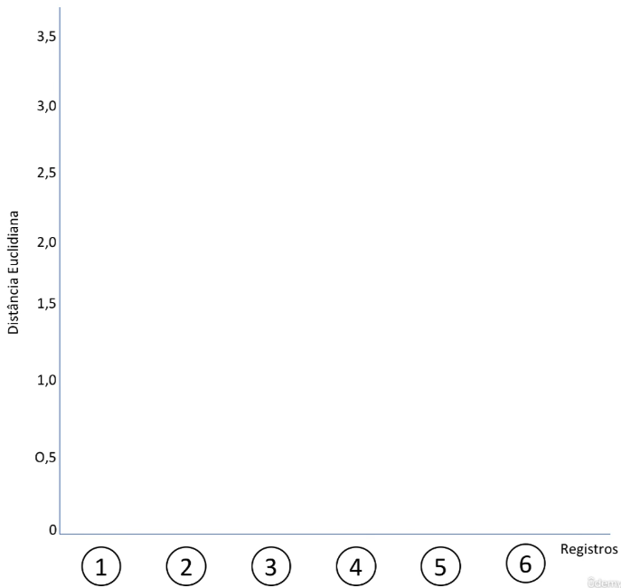
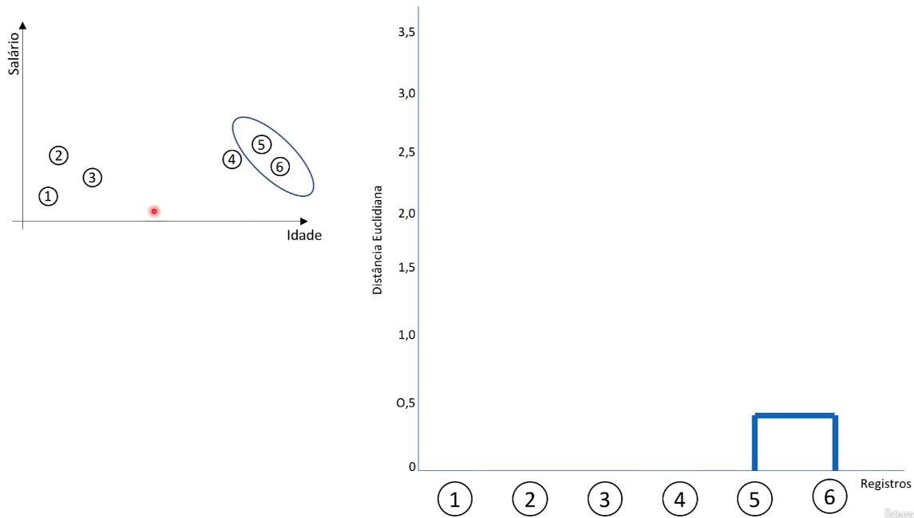
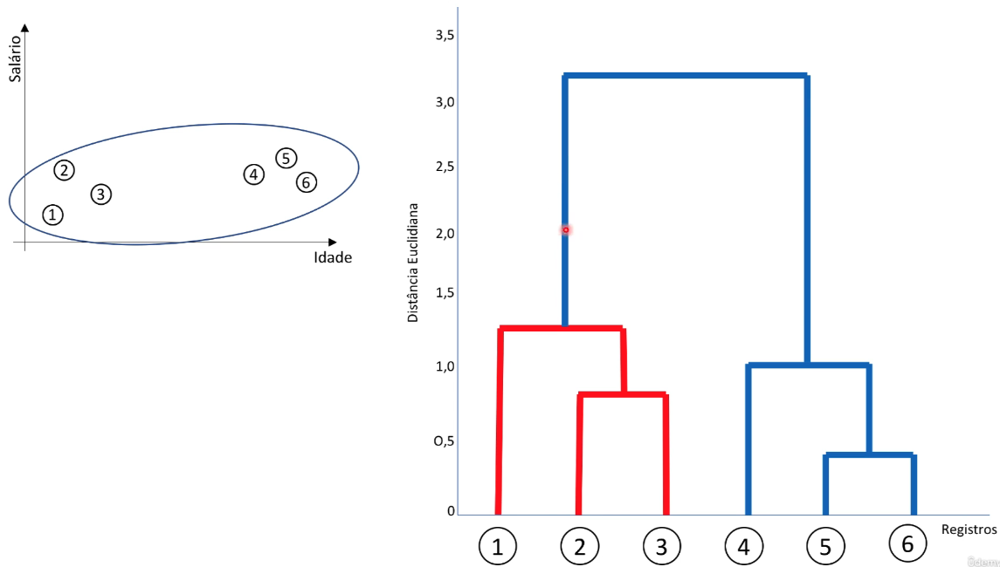
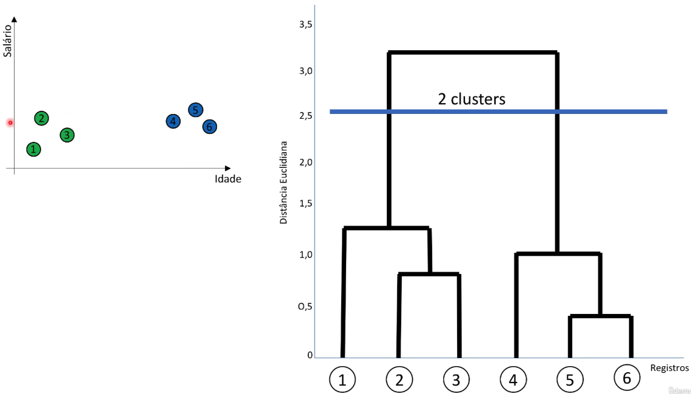

O algoritmo de agrupamento hierárquico aglomerativo é uma técnica de agrupamento usada para criar uma hierarquia de clusters em um conjunto de dados. É uma abordagem "de baixo para cima", o que significa que começa considerando cada ponto de dados como um cluster individual e, em seguida, gradualmente agrupa os clusters mais próximos até que todos os pontos de dados estejam em um único cluster ou em um número pré-especificado de clusters. Esse processo cria uma árvore hierárquica de clusters, conhecida como "dendrograma", que pode ser posteriormente cortada em diferentes níveis para obter diferentes partições dos dados.

Considere a base de dados abaixo para o entendimento do funcionamento do algoritmo de agrupamento hierárquico aglomerativo:

A seguir as etapas desse algoritmo:

1. **Inicialização**: Cada ponto de dados é tratado como um cluster individual no início.

   

2. **Medição de similaridade**: Calcula-se a matriz de distância ou similaridade entre todos os pares de clusters existentes. Existem várias medidas de similaridade que podem ser usadas, como distância euclidiana, distância de Manhattan, coeficiente de correlação, entre outras.

3. **Agrupamento**: Os dois clusters mais próximos (ou mais similares) com base na medida de similaridade são mesclados em um único cluster. Esse processo continua iterativamente, mesclando os clusters mais próximos até que todos os pontos de dados estejam em um único cluster ou em um número pré-especificado de clusters.

   

4. **Construção do dendrograma**: O dendrograma é uma representação gráfica da hierarquia de clusters. Ele mostra como os clusters foram mesclados ao longo do processo de agrupamento. Cada nó no dendrograma representa um cluster, e os nós são unidos em grupos maiores à medida que você se move para cima na árvore.

   

5. **Corte do dendrograma**: O dendrograma pode ser cortado em diferentes níveis para obter partições dos dados em diferentes números de clusters. Esse corte é uma decisão do usuário com base em seus objetivos e requisitos específicos.

   

A principal vantagem do agrupamento hierárquico aglomerativo é que ele fornece uma visão hierárquica dos dados, permitindo que você explore diferentes granularidades de agrupamento. No entanto, ele pode ser computacionalmente caro para grandes conjuntos de dados, já que requer o cálculo de todas as medidas de similaridade entre pares de clusters. Além disso, a escolha do método de ligação (como ligação única, ligação completa ou ligação média) e da medida de similaridade é importante e pode afetar os resultados.
