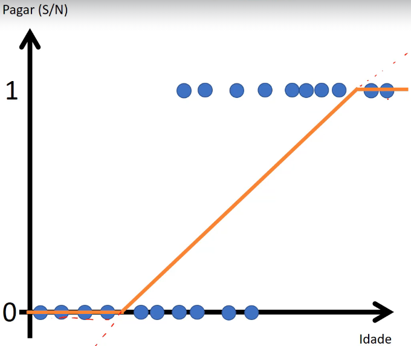

# Introdução ao algoritmo de Regressão Logística

A regressão logística é um algoritmo de aprendizado supervisionado utilizado para tarefas de classificação binária e, em algumas variações, também para classificação multiclasse. Apesar do nome, a regressão logística é utilizada para prever a probabilidade de um exemplo pertencer a uma classe específica, não para realizar regressão no sentido de prever um valor numérico contínuo. A saída da regressão logística é uma probabilidade que é transformada em uma classe por meio de um limite (threshold).

A regressão logística é especialmente útil quando se trata de relacionar um conjunto de variáveis de entrada (recursos ou atributos) a uma variável de saída binária (classe), onde a saída é uma das duas classes possíveis, por exemplo, sim ou não, positivo ou negativo, etc.

O algoritmo da regressão logística utiliza a função logística (também conhecida como sigmoid) para modelar a probabilidade de um exemplo pertencer à classe positiva:

$$
P(Y=1|X) = \frac{1}{1 + e^{-(\beta_0 + \beta_1X_1 + \beta_2X_2 + \ldots + \beta_pX_p)}}
$$

Nessa equação:

- $P(Y=1|X)$ é a probabilidade do exemplo pertencer à classe positiva, dado o conjunto de características $X$.

- $X_1, X_2, \ldots, X_p$ são as características (atributos) do exemplo.

- $\beta_0, \beta_1, \ldots, \beta_p$ são os coeficientes que a regressão logística aprende durante o treinamento.

A regressão logística busca otimizar os coeficientes $\beta$ de forma a maximizar a verossimilhança dos dados observados. Isso geralmente é feito utilizando técnicas de otimização, como o método dos mínimos quadrados ou o método de gradiente descendente.

Uma vez que os coeficientes são determinados, é possível utilizar a função sigmoid para calcular as probabilidades de classe para novos exemplos e tomar uma decisão de classificação com base em um limite (threshold) definido.

Veja abaixo um exemplo no formato de gráfico o resultado da regressão logística aplicado a um conjunto de dados com o atributo "Idade" e classe "Pagar" o qual pode assumir um valor binário "S" ou "N":

Note que a função sigmoide gera um desenho em formato de "S" (de **S**igmoide)

## **Vantagens:**

- Relativamente simples de entender e implementar.

- Pode ser interpretado como a probabilidade de pertencer a uma classe.

- Funciona bem para problemas de classificação binária e pode ser estendido para classificação multiclasse.

## **Limitações:**

- Assume uma relação linear entre os atributos e o log-odds da classe.

- Pode não funcionar bem para conjuntos de dados complexos ou com relações não-lineares.

- Sensível a outliers.

## **Casos de uso**

- Problemas de classificação binária ou multiclasse.

- Quando se deseja entender a probabilidade de pertencer a uma classe específica.

- Como um ponto de partida inicial antes de tentar algoritmos mais complexos.

É importante notar que, embora o nome "regressão" esteja presente, a regressão logística é um algoritmo de classificação e não de regressão no sentido tradicional.
