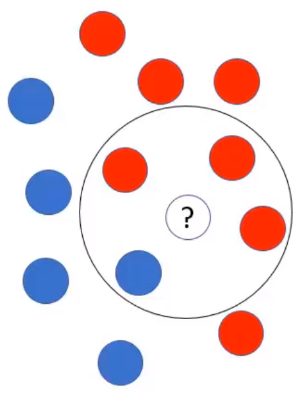

# Parâmetro "radius" em implementações de algoritmos de Naive Bayes

Algumas implementações do algoritmo Naïve Bayes possuem o parâmetro "radius" ou raio. Esse parâmetro indica ao algoritmo para selecionar alguns pontos dentro desse raio para fazer a estimativa de probabilidade. Na figura abaixo, temos um exemplo que ilustra esse conceito:

Onde: 

- Bola com interrogação: novo registro a ser estimado a cor

Temos:

- $P(\text{vermelho}) = \frac{7}{12}$: probabilidade das bolas vermelhas

- $P(\text{azul}) = \frac{5}{12}$: probabilidade das bolas azuis

- $P'(\text{vermelho}) = \frac{3}{7}$: probabilidade das bolas vermelhas dentro do raio

- $P'(\text{azul}) = \frac{1}{5}$: probabilidade das bolas azuis dentro do raio

> Todas essas probabilidades são denominadas **probabilidades apriori**.

Agora, com essas estatísticas básicas calculadas, valores fazer a estimativa de cor desse novo registro com base na maior probabilidade:

- $P''(\text{vermelho}) = \frac{7}{12} \times \frac{3}{7} = \frac{21}{84} = 0.25$

- $P''(\text{azul}) = \frac{5}{12} \times \frac{1}{5} = \frac{5}{60} = 0.08$

> $P''(\text{vermelho})$ e $P''(\text{azul})$ são chamados de **probabilidades posteriori**

Portanto, o novo registro tem uma probabilidade de $0.25$ ou $76\%$ de ser vermelho.
