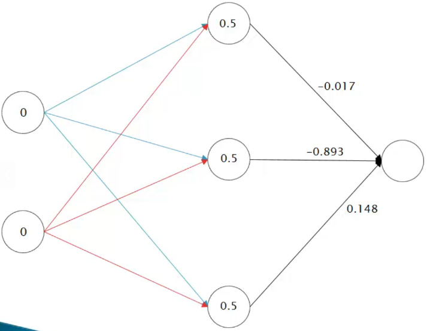

# Função de ativação na camada de saída de redes multicamada

Após calcularmos as saídas dos neurônios na camada oculta, é hora de determinarmos o valor da camada de saída.

Inicialmente, aplicamos a função de soma:

$$
\text{soma} = \sum_{i=1}^{n}{x_i \cdot w_i} = 0.5 \cdot (-0.017) + 0.5 \cdot (-0.893) + 0.5 \cdot 0.148 = -0.381
$$

Em seguida, aplicamos a função de ativação utilizando o valor obtido na soma como parâmetro:

$$
y = \frac{1}{1 + e^{-x}} = 0.406
$$

Finalmente, repetimos todo esse processo para cada entrada na tabela, ajustando os pesos conforme necessário e obtendo os resultados da camada de saída correspondentes. 

Esse procedimento visa encontrar uma relação adequada entre os atributos de entrada e a saída desejada, contribuindo para o processo de aprendizado da rede neural.