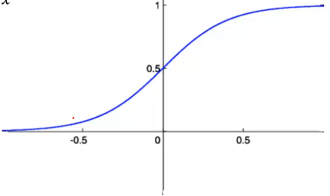
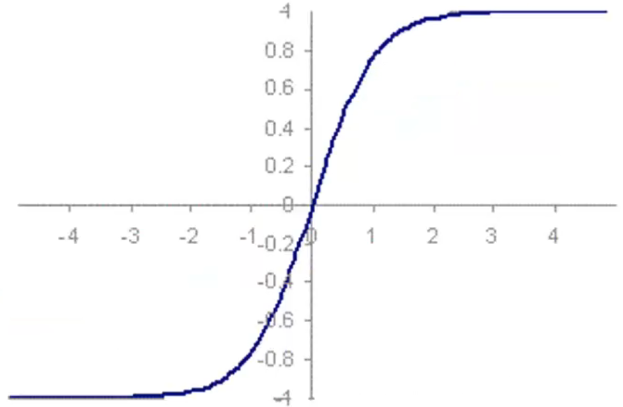

# Funções de ativação em redes neurais multicamadas

A **_step function_** (função degrau), como demonstrado anteriormente no modelo Perceptron de uma camada, é uma função de ativação simples e limitada em sua aplicabilidade, sendo adequada principalmente para esse tipo de modelo.

A **função sigmoide**, por sua vez, produz resultados dentro do intervalo $[0, 1]$, uma característica que a distingue da função degrau, cujos valores se limitam a 0 e 1. A função sigmoide é amplamente aplicável e demonstra um bom desempenho em muitos cenários. Seu gráfico pode ser visualizado abaixo:

Matematicamente, essa função é expressa como:

$$
y = \frac{1}{1 + e^{-x}}
$$

A função sigmoide é especialmente útil quando se trata de valores de probabilidade ou sempre que uma resposta binária é desejada. Notavelmente, ela não gera valores negativos.

> Neurônios que empregam a função sigmoide como função de ativação são frequentemente chamados de **neurônios sigmóides**.

No caso de cenários que requerem retornar valores negativos, existe a **função tangente hiperbólica** (_hyperbolic tangent_), que gera valores no intervalo $[-1, 1]$:

$$
y = \frac{e^x - e^{-x}}{e^x + e^{-x}}
$$

O gráfico dessa função é o seguinte:

A escolha da função de ativação depende da natureza do problema e dos resultados desejados, e cada uma dessas funções possui suas próprias vantagens e aplicações específicas.