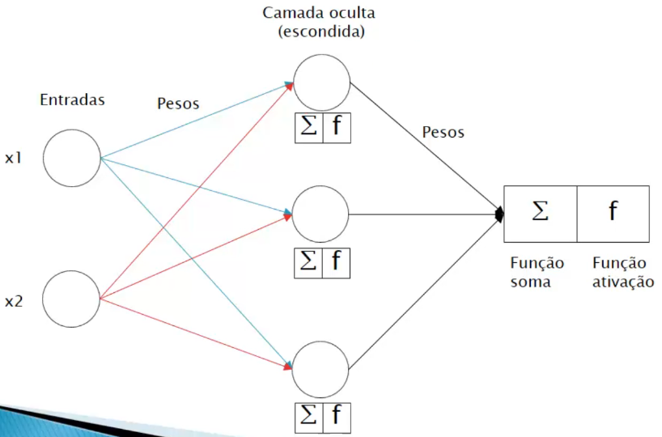

# Introdução às redes neurais multicamada

Embora o modelo Perceptron tenha tido sucesso em resolver problemas linearmente separáveis, ele não é apropriado para lidar com os desafios complexos e atuais da mesma forma. Para enfrentar essa complexidade, surgiu uma evolução: as **redes neurais multicamada**, também conhecidas como **_multilayer perceptron_**. A seguir, apresentamos uma representação desse avançado algoritmo:

> O software [WEKA](https://www.cs.waikato.ac.nz/ml/weka/) oferece uma implementação desse algoritmo.

É evidente que há uma adição crucial nesse novo modelo: uma camada intermediária chamada de "camada oculta". Essa camada é encarregada de executar as operações de soma e ativação, tal como a camada única do modelo Perceptron. Com base nos resultados dessa camada, as operações de soma e ativação são novamente aplicadas para chegar ao resultado final. Esse processo é conhecido como **_feed forward_**. 

Esse avanço permite às redes neurais multicamada lidar com problemas mais complexos e não linearmente separáveis, expandindo a capacidade da aprendizagem de máquina para tarefas mais desafiadoras e realistas.