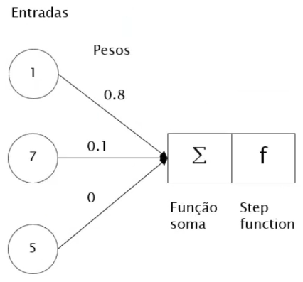
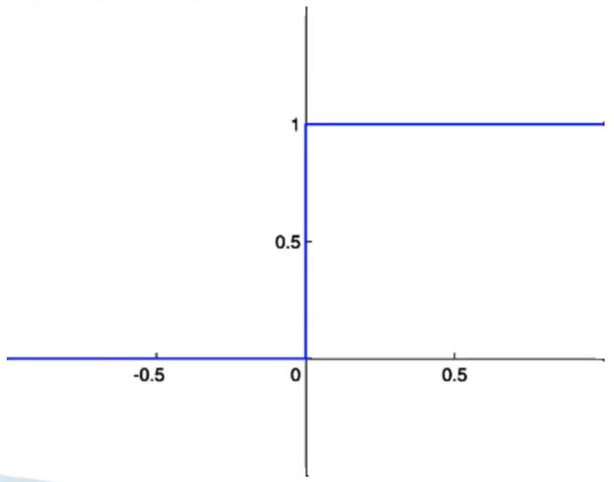

# Perceptron de uma camada

Aqui, apresentamos um exemplo de _perceptron_ de uma única camada:

Inicialmente, realizamos a aplicação da função de soma nas entradas:

$$
\text{soma} = \sum_{i=1}^n{x_i \cdot w_i} \\
\text{soma} = (1 \cdot 0.8) + (7 \cdot 0.1) + (5 \cdot 0) \\
\text{soma} = 0.8 + 0.7 + 0 \\
\text{soma} = 1.5
$$

> Vale lembrar que os pesos são análogos às sinapses, os quais desempenham o papel de ativar ou inativar os neurônios, ao ajustar o potencial elétrico do corpo da célula.

Em seguida, o valor obtido da função soma é passado pela _step function_ (função degrau), a qual decide se o neurônio artificial será ativado ou não.

A _step function_ é uma fórmula matemática empregada para determinar a ativação do neurônio. Seu funcionamento é simples:

- Se o resultado da função soma for maior que 0, o neurônio artificial é ativado, sendo atribuído o valor 1;

- Caso contrário, o neurônio é inativado, com atribuição do valor 0.

A visualização gráfica da _step function_ é apresentada abaixo:

Os pesos desempenham um papel crucial na ativação de um neurônio. Como mencionado anteriormente, eles são equivalentes às sinapses, tendo a capacidade de amplificar ou reduzir o sinal de entrada. Além disso, os pesos podem ser classificados como sinapses excitatórias (com peso positivo) ou inibitórias (com peso negativo). Consequentemente, **o conhecimento da rede neural reside nos pesos**, ou seja, o treinamento envolve encontrar o conjunto ideal de pesos para um conjunto de dados específico.