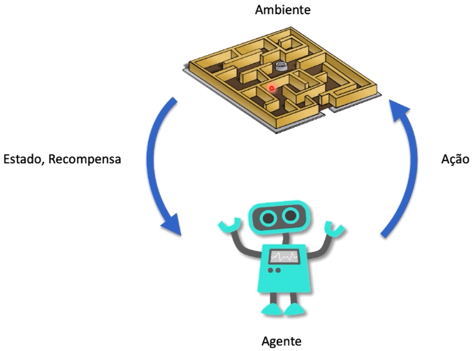
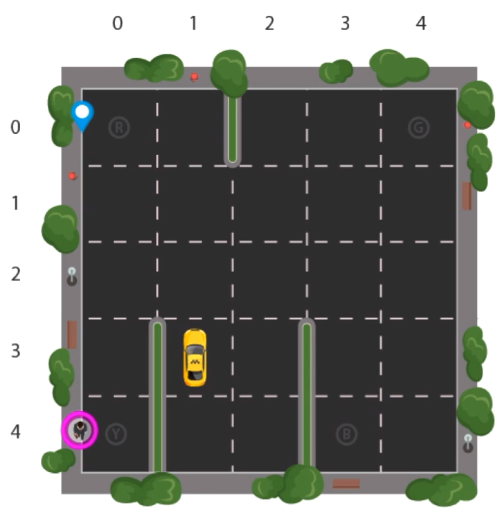
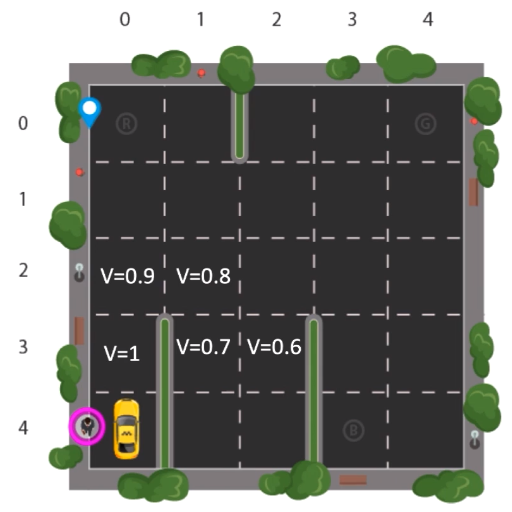

A aprendizagem por reforço é um paradigma de aprendizado de máquina que se baseia na interação de um agente com um ambiente para que o agente aprenda a tomar ações que maximizem uma recompensa cumulativa ao longo do tempo. Essa abordagem é frequentemente aplicada a problemas em que um agente deve tomar sequências de decisões para atingir um objetivo específico. Aqui estão os principais elementos que compõem a aprendizagem por reforço:

**1. Ambiente:**
	O ambiente é o espaço no qual o agente opera e interage. Ele é definido por um conjunto de estados possíveis e as transições entre esses estados, geralmente representadas por meio de um modelo de probabilidade. Cada estado do ambiente representa uma configuração específica em um ponto no tempo. O ambiente também fornece recompensas ao agente como feedback sobre suas ações.

**2. Agente:**
	O agente é a entidade de tomada de decisões que interage com o ambiente. O agente toma decisões com base em seu conhecimento e nas informações que recebe do ambiente. O objetivo do agente é aprender a política de ação ideal, ou seja, a estratégia que determina qual ação tomar em cada estado para maximizar a recompensa cumulativa.

**3. Ação:**
	As ações representam as escolhas disponíveis para o agente em um determinado estado. O agente seleciona ação(s) com base em sua estratégia de política. A sequência de ações tomadas pelo agente ao longo do tempo forma sua política de ação, que é o cerne do aprendizado por reforço.

**4. Estado:**
	O estado é uma representação do ambiente em um determinado momento. Ele captura todas as informações relevantes que o agente precisa para tomar decisões. O estado pode ser observável (totalmente conhecido pelo agente) ou parcialmente observável (algumas informações são ocultas).

**5. Recompensa:**
	A recompensa é um valor numérico que o ambiente fornece ao agente após cada ação. A recompensa é usada pelo agente para avaliar o quão boa ou ruim foi sua ação. O objetivo do agente é maximizar a recompensa cumulativa ao longo do tempo.

A [[Equação de Bellman|equação de Bellman]] é uma ferramenta-chave na aprendizagem por reforço e fornece uma maneira de calcular o valor esperado de um estado ou estado-ação. Ela é expressa em duas formas: a equação de Bellman para o valor de estado (V) e a equação de Bellman para o valor de ação (Q).

## Exemplo

A seguir um exemplo para ilustrar o processo de aprendizagem:

Considere um problema no qual o taxi precisa pegar o passageiro em Y e deixá-lo nos destinos R, B e G. Para isso, é necessário seguir algumas regras.

Os movimentos (ações) permitidos são:

- Cima
- Baixo
- Esquerda
- Direita
- Pegar o passageiro
- Deixar o passageiro
  
As recompensas são:

- -10: buscar o passageiro no lugar errado
- -10: deixar o passageiro no lugar errado
- -1: andar no ambiente (_living penalty_)
- 20: buscar e deixar o passageiro no local correto

A partir do conhecimento dos critérios de aprendizagem, as imagens a seguir mostram o passo a passo de execução do algoritmo.

> Lembrando que o algoritmo percorre sempre o caminho com o menor valor para $V$ que é obtido por $\gamma \cdot V_{anterior}$

É importante notar que a aprendizagem por reforço é frequentemente usada em cenários onde não há supervisão explícita, ou seja, o agente não recebe informações sobre quais ações são corretas ou erradas, mas deve descobrir a melhor estratégia através de tentativa e erro. Essa abordagem é poderosa e pode ser aplicada a uma ampla gama de problemas de aprendizado de máquina, incluindo jogos, robótica, automação e muito mais.
