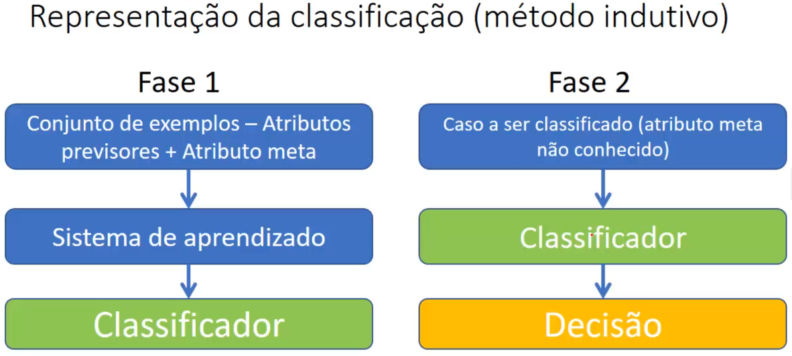
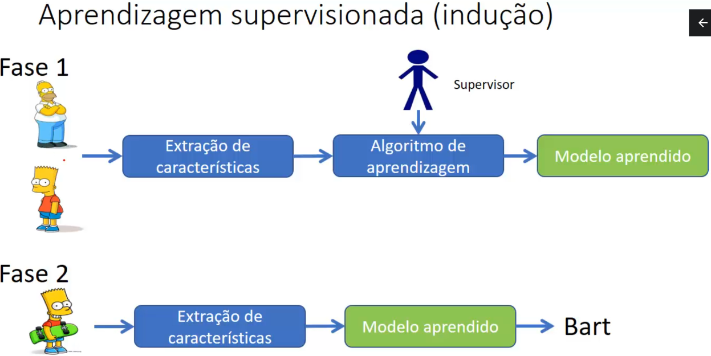

# Classificação

A técnica de classificação é uma abordagem do método descritivo que tem como objetivo atribuir objetos ou dados a diferentes categorias predefinidas com base em suas características ou atributos, conhecidos como atributos previsores. O processo de classificação envolve o treinamento de um algoritmo com um conjunto de dados rotulados, onde as classes ou categorias dos objetos são conhecidas (aprendizagem supervisionada), e a variável alvo, também chamada de atributo meta ou variável dependente, é o que se deseja prever ou classificar em um modelo de aprendizado de máquina.

Durante o treinamento, o algoritmo analisa as características dos objetos em cada classe e aprende a identificar padrões e relações entre as variáveis que melhor distinguem as diferentes categorias. Essas relações são capturadas em um modelo ou função de classificação, que é a representação aprendida pelo algoritmo para fazer previsões.

Uma vez que o algoritmo está treinado, ele pode ser usado para classificar novos dados ou objetos em uma das categorias previamente definidas. Para isso, o algoritmo utiliza as características desses novos dados e aplica o modelo de classificação aprendido durante o treinamento para atribuir a categoria mais apropriada.

Existem vários algoritmos de classificação, cada um com suas características e aplicabilidades específicas. Alguns dos algoritmos mais comuns são:

- Árvores de Decisão: Representam uma sequência de decisões baseadas em características para chegar a uma classe final.

- Máquinas de Vetores de Suporte (SVM): Procuram encontrar o melhor hiperplano que separa as diferentes classes de dados.

- K-Vizinhos Mais Próximos (KNN): Classifica os novos dados com base na classe da maioria dos "k" vizinhos mais próximos.

- Naive Bayes: Baseia-se no teorema de Bayes para calcular a probabilidade de um dado objeto pertencer a cada classe.

- Redes Neurais: Modelam a classificação inspiradas no funcionamento do cérebro humano, usando camadas de neurônios interconectados.

A técnica de classificação é amplamente utilizada em várias áreas, como marketing, detecção de fraudes, diagnóstico médico, reconhecimento de padrões em imagens e muitas outras aplicações em que é necessário categorizar dados com base em suas características.