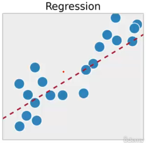
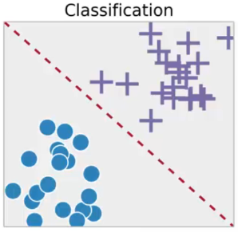

# Métodos preditivos

Métodos preditivos são técnicas usadas na ciência de dados e no aprendizado de máquina para fazer previsões sobre eventos futuros ou para classificar dados em diferentes categorias com base em padrões e informações disponíveis nos dados de treinamento.

### **Regressão** 

A regressão é um método preditivo usado quando queremos prever valores numéricos contínuos. Ele estabelece uma relação entre as variáveis independentes (características) e a variável dependente (valor a ser previsto). O modelo de regressão encontra a melhor linha ou curva que se ajusta aos dados de treinamento para estimar valores desconhecidos com base nessas relações. 

Alguns exemplos que utilizam a técnica de regressão:

- Gastos ou propaganda ->  valor de venda

- Temperatura, umidade, pressão do ar -> velocidade do vento

- Fatores externos -> valor do dólar

- Resultados do exame -> probabilidade de um paciente sobreviver

- Risco de investimento

- Gastos no cartão de crédito, histórico de dados -> limite do cartão de crédito

- Valores anteriores -> valores futuros de produtos

> As previsões (valor de venda, velocidade do vento, etc) são todos necessariamente valores numéricos.

### **Classificação** 

A classificação é outro método preditivo usado para atribuir objetos ou dados a diferentes categorias predefinidas com base em suas características. O algoritmo de classificação é treinado com um conjunto de dados rotulados, em que as classes já são conhecidas. O objetivo é aprender padrões a partir dos dados de treinamento para classificar novos dados em uma dessas classes. Alguns algoritmos de classificação comuns são árvores de decisão, máquinas de vetores de suporte (SVM) e k-vizinhos mais próximos (KNN).

Alguns exemplos que utilizam a técnica de classificação:

- **Marketing direto** (estratégias de marketing focadas em promover produtos ou serviços usando ações diretas para um público específico.)

- **Insatisfação de clientes**

- **Risco de crédito**

- **Filtros de SPAM**

- **Separação de notícias**

- **Reconhecimento de voz**

- **Reconhecimento de face**

- **Previsão de doenças**