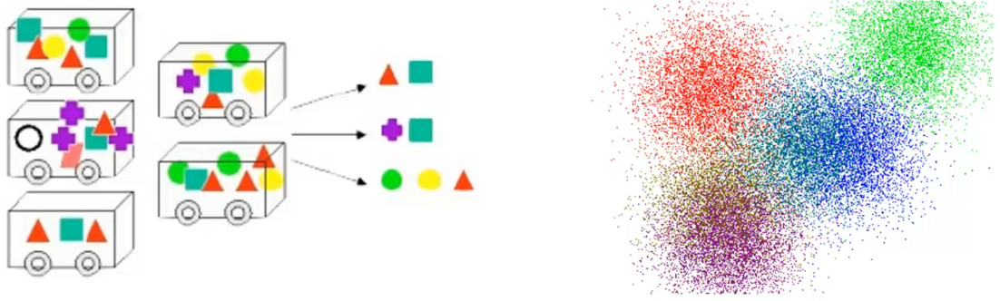

# Tipos aprendizagem de máquina

Existem três principais tipos de aprendizagem de máquina: supervisionada, não supervisionada e por reforço. Cada tipo tem suas características distintas e aplicações específicas.

Esses três tipos de aprendizagem de máquina têm aplicações distintas e complementares. Aprendizagem supervisionada é adequada para problemas de previsão e classificação quando os rótulos estão disponíveis. Aprendizagem não supervisionada é útil para descobrir padrões e estrutura nos dados sem a necessidade de rótulos. A aprendizagem por reforço é aplicada em cenários de tomada de decisões e controle, onde o algoritmo aprende a agir de maneira a maximizar as recompensas em um ambiente dinâmico.

### **Aprendizagem Supervisionada**

Na aprendizagem supervisionada, o algoritmo é treinado com um conjunto de dados rotulados por um supervisor, onde as entradas (características) estão associadas a rótulos ou saídas desejadas. O objetivo é aprender uma função que mapeia as entradas para as saídas, permitindo fazer previsões ou classificações em novos dados. O algoritmo é supervisionado pelos rótulos fornecidos nos dados de treinamento, de modo que ele possa ajustar seus parâmetros para fazer previsões precisas em dados não vistos. 

Exemplos de algoritmos supervisionados incluem regressão linear, regressão logística e máquinas de vetores de suporte (SVM).

### **Aprendizagem Não Supervisionada**

Na aprendizagem não supervisionada, o algoritmo é treinado com um conjunto de dados não rotulados, ou seja, não há saídas desejadas fornecidas no treinamento. O objetivo é encontrar padrões e estruturas ocultas nos dados sem saber previamente as classes ou categorias. Os algoritmos de aprendizagem não supervisionada exploram a estrutura dos dados para organizar, agrupar ou reduzir dimensionalidade, revelando informações relevantes e insights úteis. Todos esse processo de análise é feito de forma automática. 

Exemplos de algoritmos não supervisionados incluem o agrupamento (clustering) com k-médias, análise de componentes principais (PCA) e agrupamento hierárquico.

### **Aprendizagem por Reforço**

Na aprendizagem por reforço, o algoritmo é treinado em um ambiente interativo em que toma ações e observa o resultado dessas ações (relacionado à ideia de causa e efeito). O objetivo é aprender a melhor sequência de ações para maximizar uma recompensa em um ambiente específico. O algoritmo interage com o ambiente, recebendo feedback em forma de recompensas ou punições, e utiliza essa informação para aprender a política de decisão que levará a melhores resultados ao longo do tempo. 

É frequentemente utilizado na área de Sistema de Multiagente (SMA), em problemas de controle e tomada de decisões em tempo real, como em jogos e robótica.
