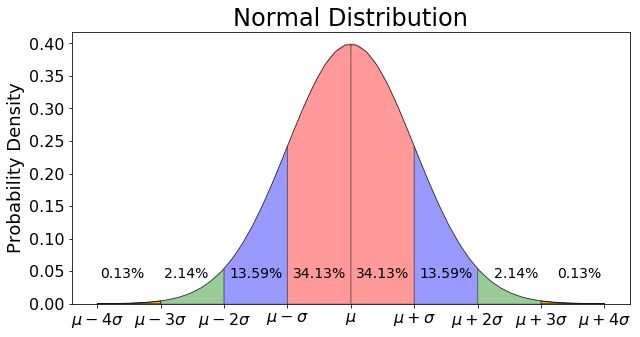

# Distribuição Gaussiana

A distribuição gaussiana, também conhecida como distribuição normal, é uma das distribuições mais fundamentais e amplamente observadas em estatística e probabilidade. Ela é caracterizada por sua forma simétrica em torno da média, com a maioria dos dados concentrados perto da média e diminuindo à medida que se afastam dela. A curva de uma distribuição normal é em forma de sino e é definida pelos seus parâmetros principais: a média ($\mu$) e o desvio padrão ($\sigma$).

As principais características da distribuição normal incluem:

1. **Simetria:** A distribuição normal é simétrica, o que significa que os valores à esquerda da média são espelhados nos valores à direita da média.

2. **Média, Mediana e Moda são iguais:** Na distribuição normal, a média, mediana e moda estão todas no mesmo ponto central da curva, tornando-a uma distribuição de referência para muitas análises estatísticas.

3. **68-95-99.7 Regra:** Cerca de 68% dos dados estão dentro de um desvio padrão da média, 95% estão dentro de dois desvios padrão e 99.7% estão dentro de três desvios padrão.

   

4. **Curva Assintótica:** A curva da distribuição normal nunca toca o eixo x (eixo horizontal), mas se aproxima infinitamente dele. Isso significa que a probabilidade de encontrar valores extremamente distantes da média é muito baixa, mas não é zero.

5. **Transformações Lineares:** Uma transformação linear de uma ou mais variáveis aleatórias normalmente distribuídas resultará em uma nova variável com distribuição normal.

A distribuição normal é fundamental em muitas áreas da estatística e do aprendizado de máquina, pois muitos métodos estatísticos assumem que os dados seguem uma distribuição normal. Isso ocorre devido a propriedades matemáticas convenientes da distribuição normal, que facilitam o cálculo de probabilidades e a realização de inferências estatísticas. No contexto do aprendizado de máquina, a normalidade dos dados pode ser uma suposição importante em certos modelos, como regressão linear e análise de variância.
