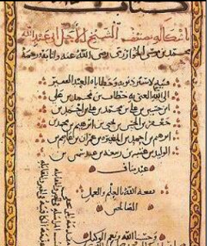

# Introdução ao Algoritmo

> ## **Origem**

O termo algoritmo serve para indicar **regras de operações aritméticas** usando algarismos indoarábicos.

No manuscrito _Livro-Compêndio_ sobre Cálculo por Restauração e Balanceamento, mostra exemplos de tais regras (figura abaixo).

> O termo algoritmo foi utilizado pela primeira vez no século IX, pelo cientista, astrônomo e matemática _Abū ‘Abd Allāh Muhammad ibn Mūsā al-Khwārizmī_.

No século XII, foi traduzido ao latim _Algorithmi_, por _Adelardo de Bath_. Desde então, esse termo evoluiu e abrange **todos os processos** definidos para **resolver problemas** ou **realizar tarefas**.

E foi em 1936, quando o termo **algoritmo foi consolidado** graças a contribuição de _Alan Turing_ e _Alonzo Church_.

> **Máquinas de Turing** e **Cálculo Lambda** são modelos desenvolvidos por Turing e Church, respectivamente.

> ## **Definição**

No ponto de vista computacional, **algoritmo** é como um **conjunto de regras e procedimentos lógicos** perfeitamente definidos que levam à **solução de um problema** em um **número finito de etapas**.

A ideia de um algoritmo estar "perfeitamente definido", está relacionado com os a presença de **5 propriedades fundamentais** definidas por _Donald Knuth_:

1. **Finitude**: deve sempre parar após um **número finito de etapas**

2. **Definição**: devem ser definidos com precisão, as **ações especificadas rigorosamente** e **sem ambiguidades**

3. **Entrada**: **valores fornecidos** ao algoritmo antes da sua execução

4. **Saída**: **resultados** a partir de uma determinada entrada

5. **Eficácia**: todas as **operações devem atender os requisitos mínimos** para serem executadas com precisão e em um período de tempo finito por um homem usando papel e lápis

> ## **Conclusão**

Os **algoritmos** são uma **sequência lógica de passos com começo, meio e fim**.
