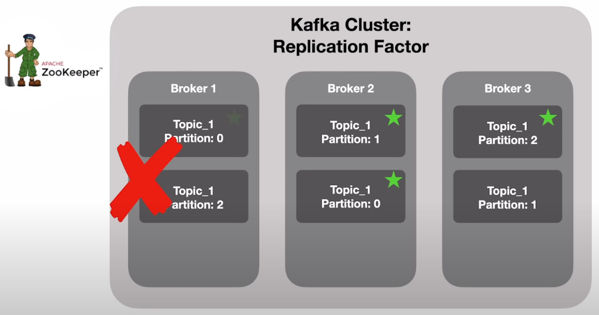
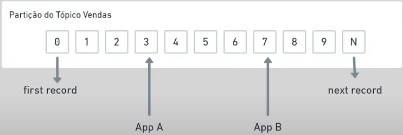
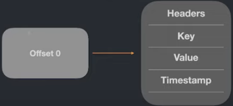
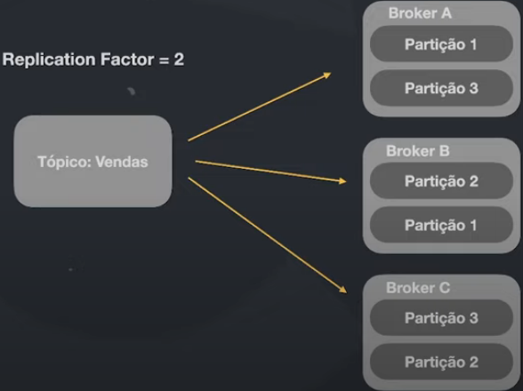

# Conceitos e dinâmica básica de funcionamento

> ## **Funcionamento do Apache kafka**

### **Representação**

> ## **Conceitos**

### **Producer**

Responsável pelo envio de mensagens (eventos) para o Apache Kafka.

Consumer lê os dados contidos dentro das partições.

### **Kafka Cluster**

Conjunto de *Brokers* no Kafka.

Cada *Broker* é responsável por armazenar os dados de uma partição.

Cada partição de um *Topic* está distribuído em diferentes *Brokers*.

> **Brokers**: é uma máquina (*server*) com o Kafka instalado nela, com isso podendo armazenar, processar, disponibilizar as mensagens

### **Replication Factor**

Replicar as partições em *brokers* diferentes.

### **Apache ZooKeeper**

É um serviço de *Service Discovery* que verificará o status das máquinas (*Brokers*) e caso algum desses *Brokers* não estiver saudável, o **ZooKeeper** faz o rebalanceamento de responsabilidades, e assim define um novo líder do *Topic* afetado.

### **Consumer** (aplicação)

Responsável pela leitura das mensagens(eventos) armazenadas no Kafka.

* **OBS**: o Kafka **não** envia mensagem para o consumer

### **Consumer Groups**

Aumenta a vazão dos dados (mensagens).

**IMPORTANTE**: 1 partição para 1 consumer (Kafka não permite ter 1 partição para 2 ou + consumer).

### **Topic** 

  
É o canal de comunicação (*stream de dados*) responsável por receber e disponibilizar os dados enviados para o Kafka. Todos as mensagens são salvas em um **banco de dados em disco**, ou seja, cada tópico tem seu "local" de armazenamento dos seus dados.

> **OBS**: mesmo tendo as mensagens salvas em disco, a leitura e escrita é feita de forma extremamente rápida.

Um tópico possui diversas **partições**.

Cada mensagem possui um índice (**offset**) que será utilizado pelo consumidor para recuperá-lo, como mostrado na imagem a seguir:

Os tópicos são como "logs", pois ficam armazenados em disco além do Kafka fornecer uma **política de retenção** das mensagens.

### **Registro**

Composto por alguns metadados: *headers*, *key*, *value* e *timestamp*

### **Partições**

Cada tópico pode ter uma ou mais partições afim de garantir a **distribuição** e **resiliência** de seus dados (mensagens e suas réplicas).

Cada partição é definido por um número, como mostrado no exemplo a seguir: `0, 1, 2, ...`

Não é obrigatório definir a quantidade de partições ao criar um tópico.

> **OBS**: quanto mais partições, menores são as chances de perda de dados

### **Partições distribuídas**

Cópias de cada partição distribuídas em vários *brokers*, com isso evitando a perda de mensagens.