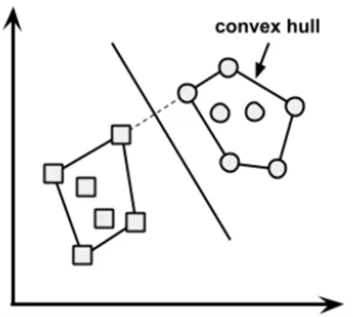
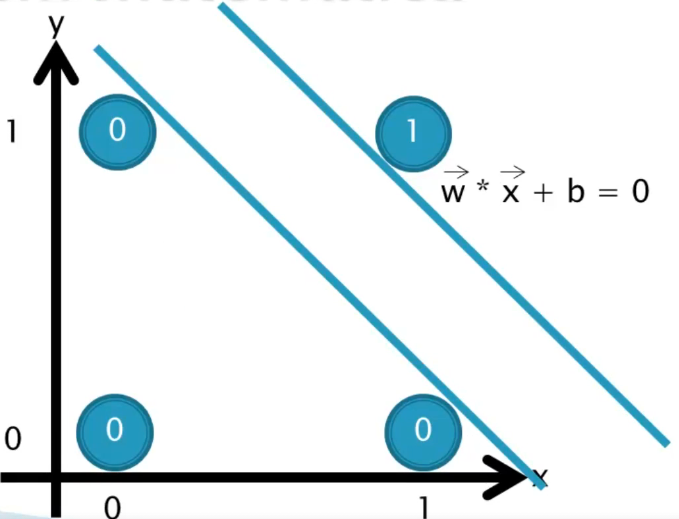
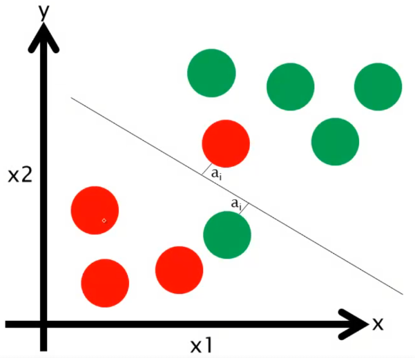

# Etapas de aprendizagem do algoritmo SVM

A etapa de aprendizado do _Support Vector Machine_ (SVM) é crucial para definir o hiperplano que otimiza a separação das classes de dados. O objetivo é encontrar um hiperplano que maximize a margem entre os vetores de suporte, que são os pontos mais próximos do hiperplano e desempenham um papel fundamental na construção da fronteira de decisão.

## Técnicas de Criação do Hiperplano

Existem duas técnicas proeminentes para criar o hiperplano de separação:

### Convex Hulls (Envoltória Convexa)

Na abordagem de _Convex Hulls_, cria-se uma envoltória convexa que abrange os vetores de suporte de cada classe. A menor distância entre essas envoltórias é determinada, e o hiperplano é traçado ao longo da mediatriz dessa distância, garantindo uma margem máxima entre as classes.

### Produto Escalar (Dot Product)

O método do _Produto Escalar_ é amplamente empregado na prática. Ele envolve a multiplicação das matrizes das classes para traçar retas parciais que são, então, utilizadas para definir o hiperplano com a maior margem entre essas retas.

A fórmula do _Produto Escalar_ é dada por:

$$
\overrightarrow{w} \cdot \overrightarrow{x} + b = 0
$$

## Considerações sobre Erros e Custos

A compreensão dos conceitos de erros e custos é essencial para analisar o funcionamento do SVM.

Observando a imagem acima, podemos identificar registros classificados incorretamente. O SVM se esforça para minimizar esses erros (expressos como distância $a_i$). Isso é realizado pela formulação da função de custo, que visa encontrar um equilíbrio entre a maximização da margem e a minimização de classificações errôneas. A fórmula para calcular o custo é:

$$
\frac{1}{2} \times |w|^2 + c \times \sum_{i}{a_i}
$$

Nessa fórmula:

- $w$ é o vetor de pesos associados aos atributos.
- $c$ representa o termo de penalização por classificações incorretas.
  - $c$ elevado: Busca-se uma separação exata das classes, com tolerância mínima para erros.
  - $c$ reduzido: Permite-se uma margem maior, priorizando a generalização sobre a precisão absoluta.