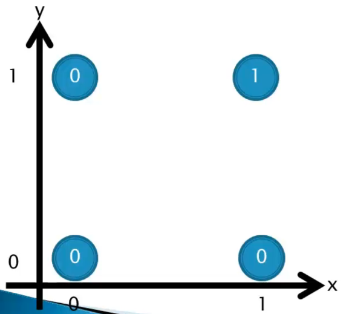
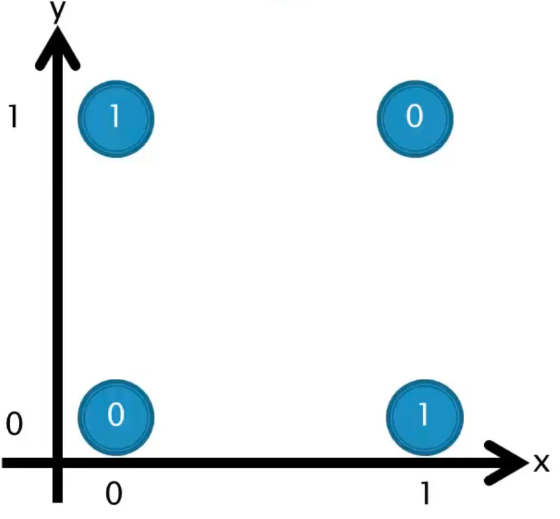
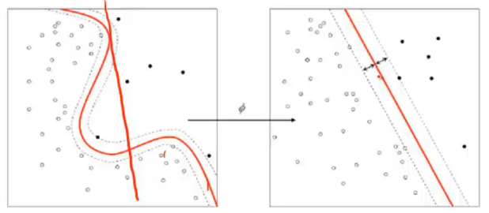
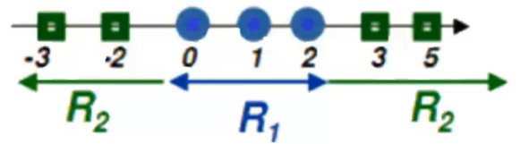
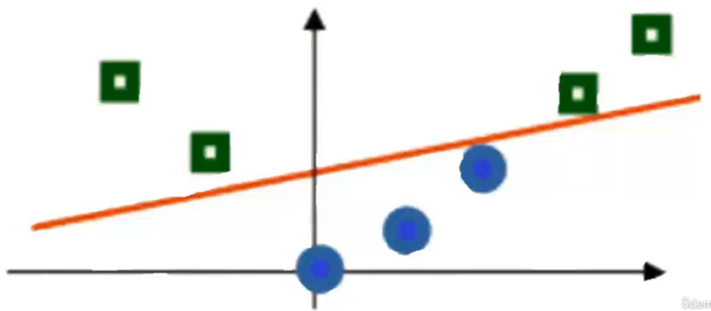

# Problemas linear e não linear

Para compreender como o hiperplano com a máxima margem é definido, é essencial distinguir entre problemas linearmente e não linearmente separáveis.

## **Problema Linearmente Separável**

Considere o gráfico que representa a relação do operador lógico `and` ("e"):

Neste cenário, podemos identificar um problema linearmente separável. É possível traçar uma reta que claramente divide as duas classes (0 e 1), tornando a separação direta.

## **Problema Não Linearmente Separável**

Agora, observe o gráfico que representa a relação do operador lógico `xor` ("ou exclusivo"):

Aqui, estamos lidando com um problema não linearmente separável, pois não é viável traçar uma única reta para separar as duas classes (0 e 1).

Para abordar esse tipo de desafio, surge a técnica do **_kernel trick_** nos algoritmos SVM. Essa abordagem envolve a transformação dos dados por meio de uma função kernel, permitindo a criação de um hiperplano em um espaço de dimensões mais elevadas, onde a separação das classes seja possível. Veja a representação abaixo:

Um exemplo simples de _kernel_ é o **linear**, que adiciona uma dimensão extra ao elevar os dados ao quadrado. Isso pode ser visualizado na seguinte ilustração:

Antes do _Kernel Trick_:

Após a aplicação da função _kernel_, os dados são representados da seguinte forma:

Nesse contexto:

- No eixo $X$, temos os dados originais;
- No eixo $Y$, temos os dados elevados ao quadrado.

## **Funções de Kernel**

As funções de _kernel_ são cruciais para implementar o _kernel trick_ e tornar a separação de classes não linear possível. Algumas funções de _kernel_ comuns incluem:

|        Kernel        |                              Inner Product Kernel                              |
| :------------------: | :----------------------------------------------------------------------------: |
|        Linear        |                            $K(x, y) = (x \cdot y)$                             |
|      Gaussiana       | $K(x, y) = exp\left(- \frac{\|\| x - x_i \|\| ^2}{2 \times \sigma ^ 2}\right)$ |
|      Polinomial      |                           $K(x, y) = (x \cdot y) ^P$                           |
| Tangente Hiperbólica |                      $K(x, y) = tanh(x \cdot y - \theta)$                      |

Essas funções de _kernel_ permitem a transformação dos dados em um espaço onde as classes podem ser separadas linear ou não linearmente, abrindo caminho para uma modelagem mais flexível e precisa por parte do SVM.
