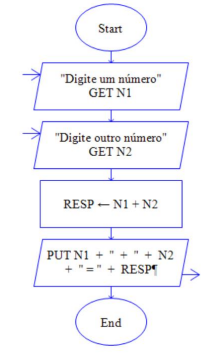
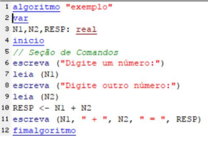
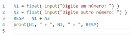

# Lógica de programação

> ## **Definição**

A lógica de programação é fundamental para **identificar e resolver os requisitos implícitos de Knuth**.

Na ótica da Filosofia Aristotélica, a lógica serve para tratar as **formas de pensar** (dedução, inclusão, hipótese, inferência, etc) e as **formas de operações intelectuais** (conceito, juízo e raciocínio) afim de determinar o que é verdadeiro ou falso.

### **Operações intelectuais**

1. **Conceito**: representação mental do objeto

2. **Juízo**: ato mental de afirmação ou de negação de uma ideia em relação à outra

3. **Raciocínio**: articulação de vários juízos

### **Representação**

A lógica de um processo por ser representado das seguintes formas:

- [Fluxograma](#fluxograma)

- [Pseudocódigo](#pseudocódigo)

- [Linguagem de programação (Python)](#linguagem-de-programação-python)

> ## **Fluxograma**

### **Definição**

Utiliza símbolos gráficos para descrever, cada passo, a natureza e fluxo de um processo.

### **Objetivo**

Mostrar o fluxo das informações e os elementos envolvidos, evidenciando a sequência operacional do processo a ser executado.

### **Exemplo**

> Problema: Escreva uma sequência de passos para se obter dois números, calcular e apresentar a soma desses valores.

> ## **Pseudocódigo**

### **Definição**

É uma forma genérica de descrever um algoritmo, que usa um linguagem simples (nativa a quem o escreve, por exemplo em Português) sem a necessidade de conhecer a sintaxe de nenhuma linguagem de programação.

Os pseudocódigos não são muito recomendados, pois podem gerar ambiguidades. Desse modo, ferem uma das propriedades fundamentais do algoritmo de _Donald Knuth_ a `definição`.

**IMPORTANTE**: linguagem de programação **NÃO** é uma linguagem de programação

### **Exemplo**

> Problema: Escreva uma sequência de passos para se obter dois números, calcular e apresentar a soma desses valores.

> ## **Linguagem de programação (Python)**

### **Definição**

É uma linguagem de programação gratuita e de código aberto. Conta com uma grande comunidade e está em contínuo aperfeiçoando. Suporta programação procedural, funcional e Orientada a Objetos.

### **Exemplo**

> Problema: Escreva uma sequência de passos para se obter dois números, calcular e apresentar a soma desses valores.

