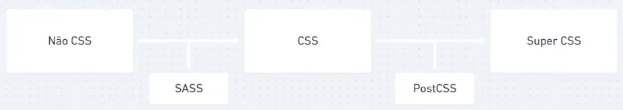

# Pré e pós processadores

> ## **SASS**

> ## **LESS**

> ## **Stylus**

> ## **PostCSS**

### **Definição**

_PostCSS_ é um tipo de pós processador que produz o **Super CSS**. Além disso, utilizado o _lazy load_, ou seja, os recursos são carregados sob demanda.

### **Vantagens**

- Mais rápido do que o `SASS`, `LESS` e `Stylus`