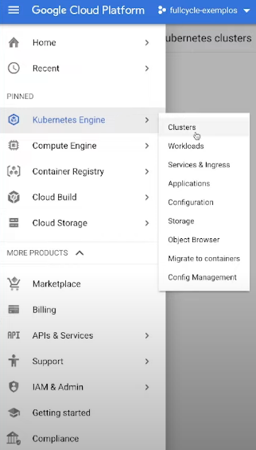
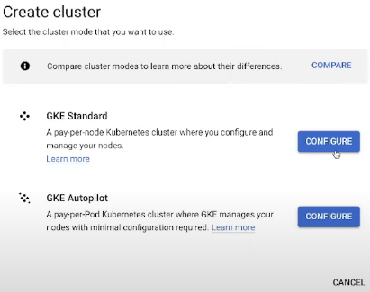
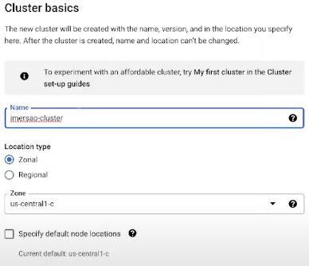
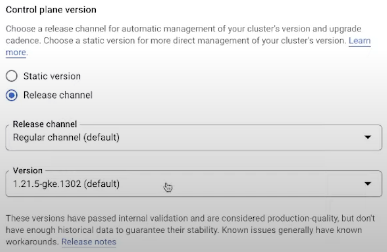
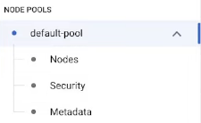
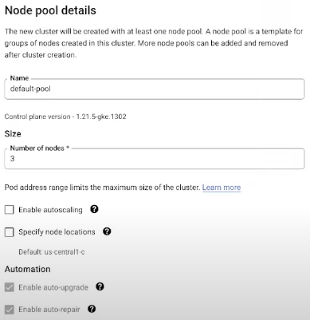
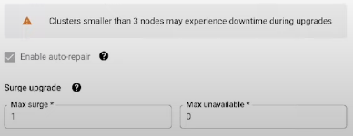

# Deploy de aplicação no GCP

> ## **Kubernetes**

### **Criação do cluster Kubernetes**

* Menu > "Kubernetes Engine" > "Clusters"
  
  

* "Create" > Na opção "GKE Standard", clicar em "Configure"

  

* Em "Cluster basic", informar os dados dos seguintes campos: "Name", "Location Type", "Version"

  

  

  > **OBS**: o campo "Version" é referente a versão do Kubernetes utilizado no Cluster

* "NODE POOLS" > "default-pool"

  

* Em "Node pool details", especificar o número de *Nodes* no *Cluster*

  

  

* Após ter realizado os passos anteriores, será iniciado a criação do seu *cluster Kubernetes*

  > **OBS**: esse processo pode levar algum tempo...