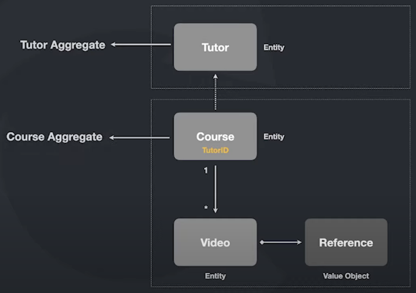

# Agregados

> ## **Definição**

"Um agregado é uma conjunto de objetos associados que tratamos como uma unidade para propósito de mundaça de dados" - Evans, Eric

Um agregado é um **conjunto de entidades e objetos de valor** que fazem parte de um **mesmo contexto de negócio**.

O nome do agregado é dado sempre a partir do **"ponto de entrada"** (***root aggregate***) da lógica desse contexto.

**OBS**: no padrão **repository**, é utilizado um repositório por agregado. Com base no exemplo abaixo: `TutorRepository` e `CouseRepository`

> ## **Exemplo**

