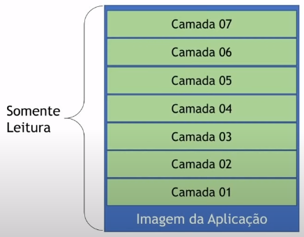
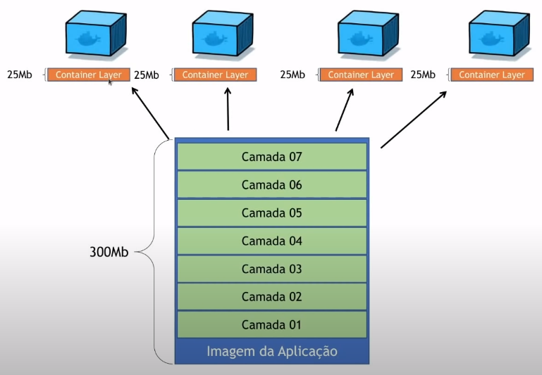

# Imagem

### Introdução

* São *templates* (**moldes**) utilizados para a criação e execução de um container

  

* A criação de *imagens Docker* utiliza a tecnologia de **Overlay Filesystem** do Linux

* Existem 2 formas de construir um imagem: **Docker Commit** ou **Dockerfile**

### Overlay Filesystem

* **Definição**: é a combinação e agrupamento de camadas de arquivos do sistema (arquivos somente leitura)

* **Função**: cada instrução, no  **Dockerfile** por exemplo, forma arquivos seja criando ou copiando os mesmos. Isso corresponde a uma camada de *file system*. Dessa modo, o empilhamento dessas camadas forma, no contexto do Docker, a **imagem**

* **Representação**

  

* **Vantagem**: reaproveitamento de espaço

  * Em imagens

    

  * Em containers

    

### Formas de criação de imagens

* **Docker commit**

  * **Função**: **criação da imagem a partir de um container**, ou seja, a geração da é feita a partir da imagem base do container, comandos executados dentro dele e arquivos copiados/criados

  * **OBS**: não é recomendado essa forma pelos seguintes motivos

    * **Inviabiliza o versionamento**, logo dificulta a sua distribuição

    * **Difícil de se reproduzir** (pelo fato de ser criado a partir de um container, a execução das instruções é feita em tempo de execução do mesmo. Portanto, não existe uma forma de versioná-lo)

    * **Dificuldade na automatização de processos** (como consequência do tópico anterior)

  * **Exemplo**: ir para o título `Exemplo: Criar um container com Ubuntu e curl`

* **Dockerfile**

  > É a forma recomendada

  * **Função**: **é uma "receita" de criação de imagem**. As instruções especificadas no Dockerfile são executas na ordem, e no final será criado a imagem

> Leitura complementar: [Boas práticas na criação de images](./good-practice/boas-praticas-dockerfile.md)