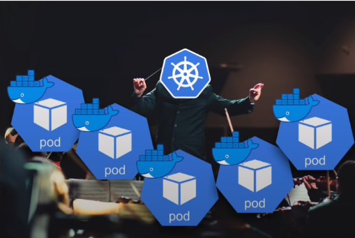
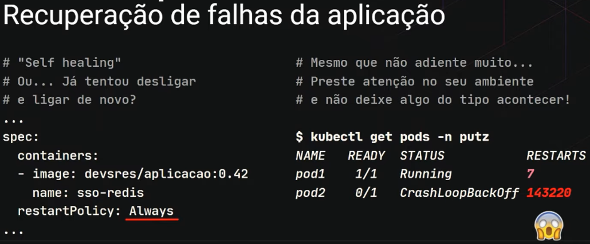
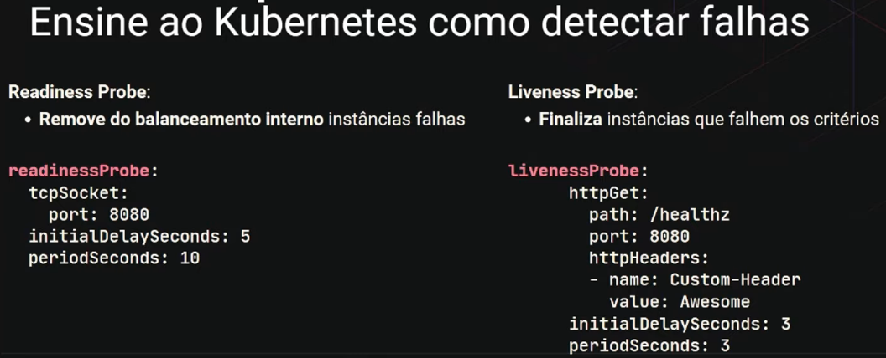
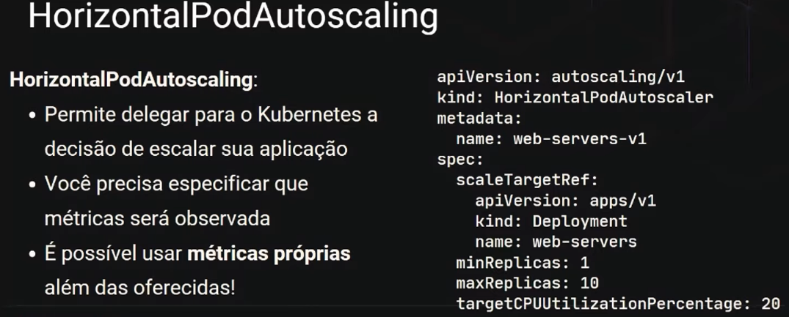
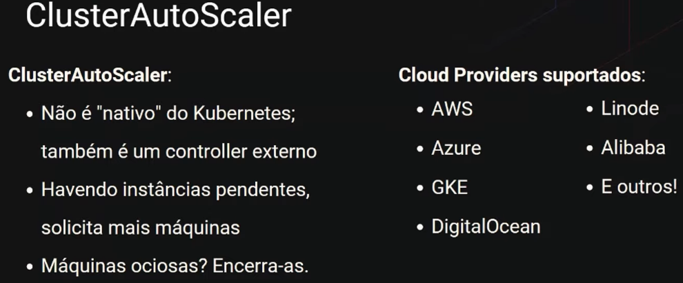

# Introdução ao Kubernetes

> ## **Kubernetes**

### **Definição**

> "Kubernetes é uma plataforma de código aberto, portável e extensiva para gerenciamento de cargas de trabalho e serviços distribuídos em containers, que facilita tanto a configuração declarativa quanto automação." - [Mantenedores](https://kubernetes.io/pt-br/docs/concepts/overview/what-is-kubernetes/)

Orquestrador (gestão e entrega) de aplicações (*containers*):

  

É um framework de infraestrutura **para containers** [**declarativo**](./imperativo-declarativo.md) (através de arquivos `.yaml`) e operado de maneira **autónoma** por meio dos *controllers*.

### **Origens**

* **Borg**: criado pelo Google com a finalidade de rodar processos (*jobs*) em uma grande quantidade de *clusters*

* **Omega**: aprimoramento do **Borg**

> **OBS**: devido à origem do K8S, o GCP (Google Could Platform) é o melhor *Cloud Provider* para Kubernetes

### **Características**

* É disponibilizado através de ua conjunto de APIs

* Normalmente o acesso à API é feito a partir do *CLI* (Command Line Interface): `kubectl`

* É baseado em estados, a configuração do estado é feito a partir de um conjunto de objetos

### **Principais objetos**

* *Pods*

* *Services*

* *Deployments*

### **Vantagens**

* Economia de recursos com a capacidade de escalar a aplicação de acordo com a demanda

* Implantação e atualização sem *downtime*

* Facilidade na realização de *rollbacks*

* **Interface agradável para desenvolvedores**

  > "É uma framework **declarativo** para **containers** operado de maneira autónoma por ***containers*** que viabiliza a **interface** entre as equipes de **desenvolvimento** e da **infraestrutura** que hospedará suas aplicações"

* **Alta disponibilidade**

  

  

  

  > Auto diagnóstico
  

  > Load Balancer
  

* **Escalabilidade**
  
  

  

  

> ## **Cluster**

### **Definição**

É um conjunto de *nodes*.

***Node***: Virtual Machine (VM) ou máquina física

Cada máquina possui uma quantidade de **vCPU** e **memória**.

  > Os recursos de cada *node* são especificados no arquivo de configuração do Kubernetes

### **Exemplos**

* AWS

* Azure

* Google Cloud Platform

* Ambientes *On-promises* (máquinas físicas com Kubernetes)

### **Estrutura do Cluster Kubernetes**

**Master Node**

  * **Definição**: responsável por gerenciar os outros nós do *cluster* (tomadas de decisões)

  * **Serviços disponibilizados pelo Kubernetes**

    * *Kube-apiserver*

    * *Kube-controller-manager*

    * *Kube-scheduler*

**Node**

  * **Definição**: responsável por rodar a aplicação (*container*)

  * **Serviços disponibilizados pelo Kubernetes**

    * *Kubelet*

    * *Kubeproxy*

> *Master* e *node(s)* se comunicam entre si.

> ## **Ferramentas**

### **Minikube**

* **Definição**: criar *clusters Kubernetes* localmente (ambiente *On-promises*)

* **Vantagens**

  * Boa comunidade

  * Várias funcionalidades e add-ons

  * Boa documentação

* **Instalação**: *Docker* + *Minikube*

### **Kubectl (Kube control)**

* **Definição**: uma ferramenta CLI para gerenciar *clusters Kubernetes*

* **Algumas ações com Kubectl**

  * Deploy

  * Inspecionar

  * Editar recursos

  * Depurar

  * Ver logs

