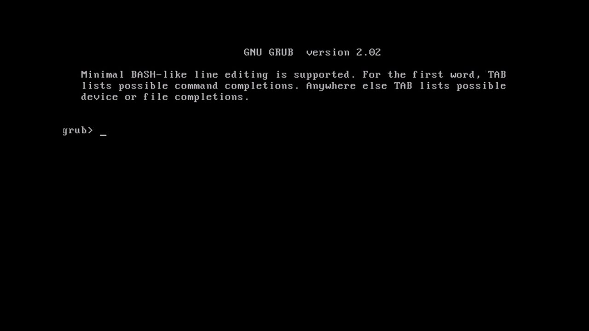
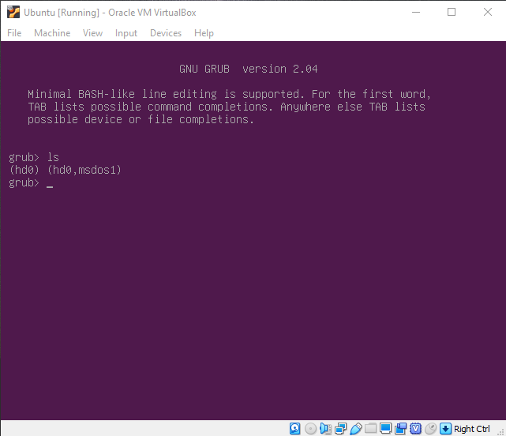
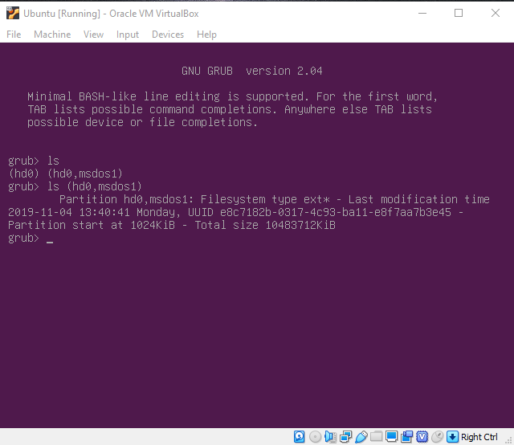
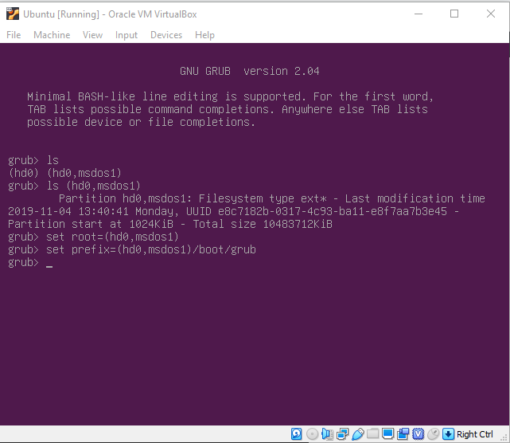
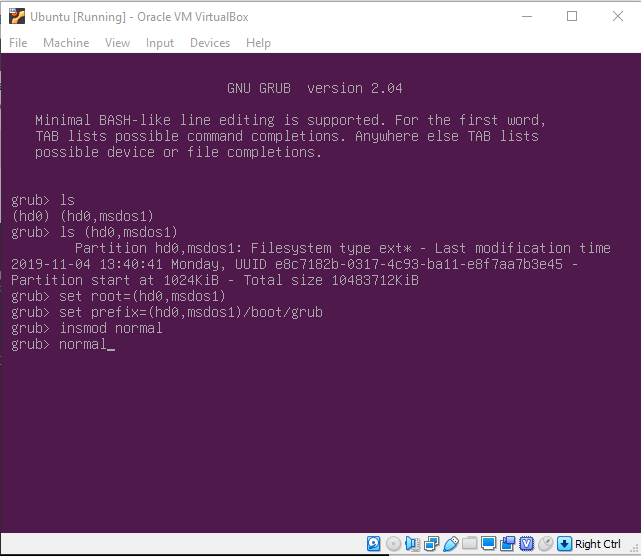
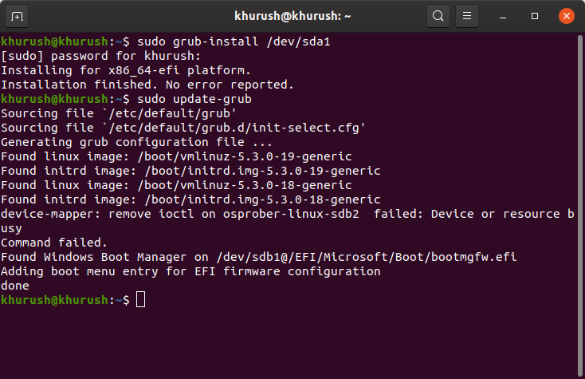

# GNU GRUB on boot Ubuntu

## **Problema**

Quando é feito o boot do Ubuntu aparece a tela do GNU GRUB, simular com a imagem abaixo:



## **Solução**

1. Achar a partição onde o Ubuntu está armazenado. Para facilitar a identificação, os sistemas operacionais Linux utilizam o sistema de arquivo ext2/ext3/ext4.

   ```bash
   grub> ls
   ```

   

2. (Opcional) Caso você não saiba em qual partição está o Ubuntu, basta utilizar o seguinte comando:

   ```bash
   grub> ls (hdX, Y)
   ```

   Onde `X` é o número do disco e `Y` é o nome da partição. Geralmente o nome da partição começa com `msdos` ou `gpt`.

   

   Com base nas informações de tamanho da partição, label (se tiver) e última data de alteração (horário do último log-in) é possível identificar a partição do sistema Linux.

3. Depois de conhecer a partição, defina as variáveis "root" e "prefix".

   - `root`: Variável que indica onde todo o sistema operacional Linux está instalado.
   - `prefix`: Variável que indica onde o GRUB está instalado.

   ```bash
   grub> set root=(hdX, Y)
   grub> set prefix=(hdX, Y)/boot/grub
   ```

   

4. Instalar o módulo `normal`:

   - `normal`: Arquivo de módulo do Linux (`linux.mod`) usado para carregar o kernel.

   ```bash
   grub> insmod normal
   ```

5. Carregar o módulo `normal`:

   ```bash
   grub> normal
   ```

   

6. Após entrar o sistema operacional Ubuntu, faça reinstalação e atualização do GNU GRUB:

   > **OBS**: quando você inicializá-lo, é possível que aconteça alguns bugs como problema na resolução do monitor, mas não precisa se preocupar porque isso será resolvido após a execução do comando a seguir.

   ```bash
   sudo grub-install /dev/sdXY
   sudo update-grub
   ```

   Onde `X` é o número do disco e `Y` é o número da partição da partição EFI. Se você não sabe qual partição é a partição EFI, use o aplicativo "Disks" ou "GParted" para verificar.

   

7. Por fim, basta reiniciar a máquina é o problema será resolvido.