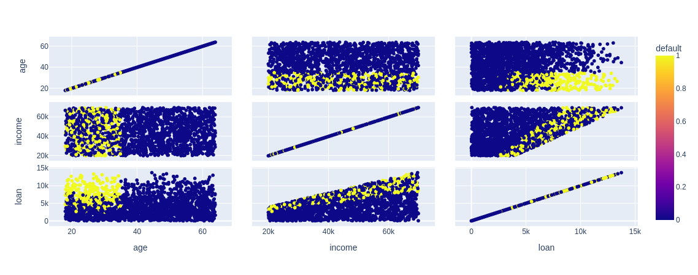

# Função `scatter_matrix`

A função `scatter_matrix()` do Plotly Express é usada para criar uma matriz de gráficos de dispersão (_scatter_) para visualizar as relações entre pares de variáveis numéricas em um DataFrame. Ela oferece recursos adicionais para visualização interativa e personalização dos gráficos.

**Sintaxe:**

```python
import plotly.express as px

fig = px.scatter_matrix(df, dimensions=[coluna1, coluna2, ...], color=coluna_cor, symbol=coluna_simbolo, ...)
fig.show()
```

**Principais parâmetros:**

- **df:** Obrigatório. O DataFrame contendo as colunas numéricas que serão plotadas nos gráficos de dispersão.

- **dimensions:** Obrigatório. Especifica as colunas numéricas que serão plotadas na matriz de dispersão.

- **color:** Opcional. Permite adicionar uma coluna categórica para colorir os pontos de acordo com seus valores.

- **symbol:** Opcional. Permite adicionar uma coluna categórica para especificar símbolos diferentes para cada categoria.

- **labels:** Opcional. Permite adicionar rótulos personalizados para as colunas do DataFrame.

- **title:** Opcional. Especifica o título do gráfico.

**Exemplo:**

```python
import plotly.express as px
import pandas as pd

# Criando um DataFrame de exemplo
base_credit = pd.read_csv("./assets/credit_data.csv")

# Plotando a matriz de dispersão com Plotly Express
grafico = px.scatter_matrix(base_credit, dimensions=["age", "income", "loan"], color="default")
grafico.show()
```

**Saída:**

