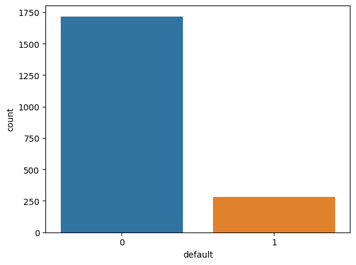

# Função `countplot`

A função `countplot()` é uma função da biblioteca Seaborn em Python, que é uma extensão do Matplotlib utilizada para criar gráficos estatísticos atraentes e informativos. Essa função é usada para plotar um gráfico de contagem, que exibe a contagem de ocorrências de cada categoria em um conjunto de dados categóricos.

**Sintaxe:**

```python
seaborn.countplot(x=None, y=None, data=None, order=None, hue=None, palette=None)
```

**Parâmetros principais:**

- **x, y:** Obrigatórios. Especificam as variáveis categóricas a serem plotadas no eixo x e/ou y. O usuário deve fornecer apenas uma das opções, pois o gráfico será bidimensional.

- **data:** Obrigatório. O DataFrame ou conjunto de dados que contém os dados a serem plotados.

- **order:** Opcional. A ordem em que as categorias devem aparecer no gráfico.

- **hue:** Opcional. Permite adicionar uma variável categórica adicional, que será representada por cores diferentes no gráfico, tornando possível a comparação entre duas variáveis categóricas.

- **palette:** Opcional. Especifica a paleta de cores a ser utilizada no gráfico.

**Exemplo:**

```python
import seaborn as sns
import matplotlib.pyplot as plt

# Criando um DataFrame de exemplo
base_credit = pd.read_csv("./assets/credit_data.csv")

# Plotando o gráfico de contagem para a coluna "Classe"
sns.countplot(x = base_credit["default"]);
```

**Saída:**



> **OBS** antes de exibir o gráfico uma mensagem similar a `<Axes: xlabel='default', ylabel='count'>`, e caso queira que isso não seja mostrado, basta colocar `;` no final da sentença da função `countplot()`.

A função `countplot()` é especialmente útil para visualizar a distribuição de dados categóricos e identificar as frequências de cada categoria de forma rápida e eficiente. Ela é muito utilizada em análise exploratória de dados e na comparação de diferentes categorias em um conjunto de dados.