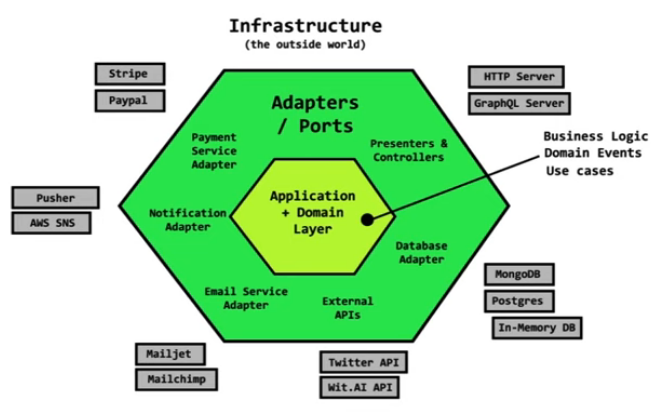
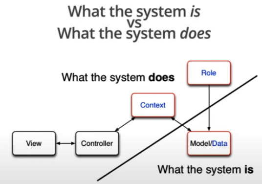

# Introdução à Arquitetura Limpa

### Ideias arquiteturais que baseou a Arquitetura Limpa

* **Ports and adapters**

  

* **Data, context and interaction (DCI)**

  

* **Boundary, control and Entity (BCI)**

  

  * Analogia à arquitetura MVC

    * Control = Controllers

    * Entity = Model

    * Boundary = View (interface entre o controlador e a entidade)