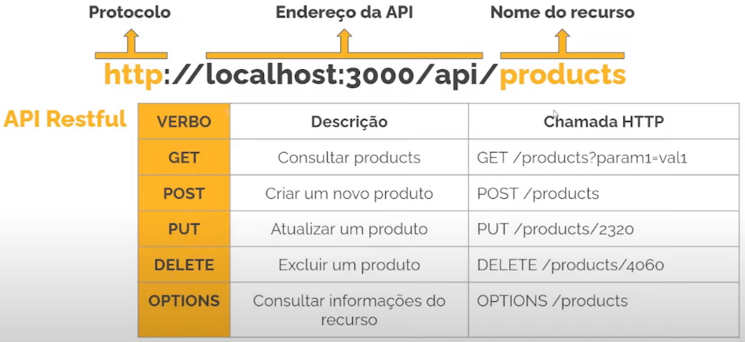

# Introdução ao REST

> ## **REST**

### **Definição**

> **REST**: *Representational State Transfer* ou Transferência de Estado Representacional

É um **estilo arquitetural** que define um conjunto de restrições e propriedades baseado no protocolo HTTP/HTTPS para o desenvolvimento de APIs.

**OBS**: REST não é um protocolo, framework ou biblioteca, mas uma especificação que define a forma de comunicação entre componentes de software na web.

### **Curiosidade**

É uma das formas mais usadas para integrações de sistemas modernos. (utiliza verbos, código, cabeçalhos e URIs para compor uma API web)

### **Vantagens**

* Reparação entre cliente e servidor

* Escalabilidade 

* Independência de linguagem 

* Amplamente adotado em quase todos os sistemas no mercado

### **Regras**

* Conceito de **cliente-servidor**

* **Stateless**: aplicação não dever ter estado, ou seja, na requisição feita à API deve conter todos os dados necessários para que seja devidamente processada.

* **Cache**: API pode armazenar as respostas das requisições  (mais performance e escalabilidade)

* **Interface uniforme**: desacoplamento estrutural da aplicação ("cada parte" possa evoluir de forma independente)

* **Sistema em camadas**

* **Código sob demanda** 

  > **Exemplo**: servidor fornece um código JS para montar um gráfico para o consumidor da API

> ## **API REST**

### **Definição**

> **API**: *Application Program Interface*

É uma API baseado no **estilo arquitetural REST**.

### **Importância de uma API (REST)**

* Facilita a comunicação entre serviços

* Independência de tecnologia

> ## **Requisição e Resposta**

### **Estrutura de uma requisição**

