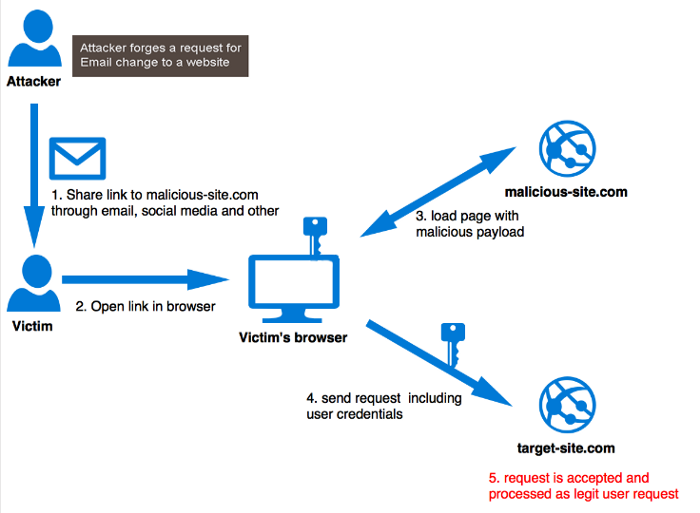

# CSRF

> ## **Definição**

**CSRF** é um acrônimo para _Cross-site Request Forgery_

É um tipo de ataque de sites maliciosos que consiste no envio de solicitações desatualizadas de um usuário no qual o website confia.

