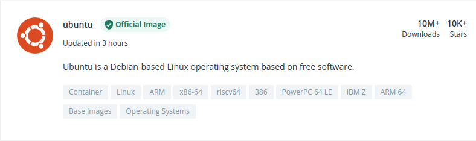
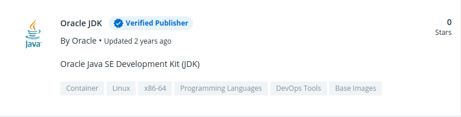
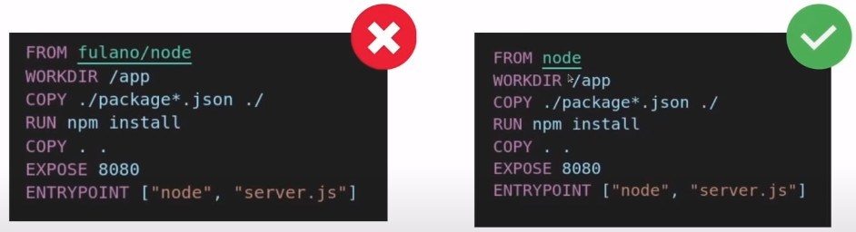
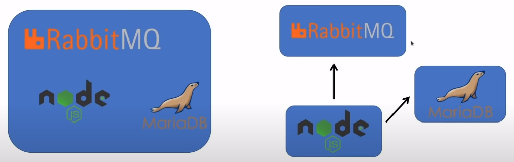
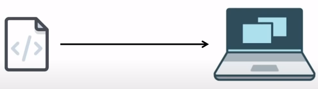
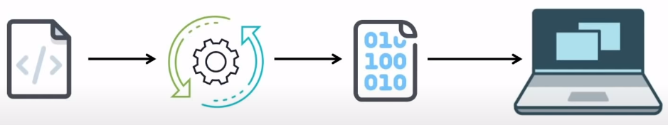

# Boas práticas no Dockerfile

### Atualização e instalação de um pacote na mesma instrução (comando)

* **Função**: **evitar erros de dependências (repositórios desatualizados)** ao utilizar um CACHE antigo para a criação de uma imagem *Docker*

* **Forma não recomendada**

  ```dockerfile
  FROM ubuntu

  RUN apt-get update
  RUN apt-get install curl -y
  RUN apt-get install vim -y
  ```

* **Forma recomendada**

  ```dockerfile
  FROM ubuntu

  RUN apt-get update && \
      apt-get install curl -y && \
      apt-get install vim -y
  ```

### Especificar a TAG da imagem

* **Função**: garantir a **idempotência**, pois ao não especificar um versão da imagem, por padrão o Docker pega a última versão (*latest*) o que pode gerar **efeitos colaterais**

* **Forma não recomendada**

  ```dockerfile
  FROM node

  WORKDIR /app

  # Copiar "package.json" e "package-lock.json" para o container
  COPY package*.json ./

  RUN npm install

  # Copiar todos os arquivos do projeto para o container
  COPY . .

  EXPOSE 8080

  CMD ["node", "index.js"]
  ```

* **Forma recomendada**

  ```dockerfile
  FROM node:14

  WORKDIR /app

  # Copiar "package.json" e "package-lock.json" para o container
  COPY package*.json ./

  RUN npm install

  # Copiar todos os arquivos do projeto para o container
  COPY . .

  EXPOSE 8080

  CMD ["node", "index.js"]
  ```

* **Exemplo**

  

### Imagens oficiais / Publicadores oficiais

* **Função**: **garantir segurança**, pois imagens não oficiais/verificadas podem conter malware afim de coletar dados, minerar bitcoin, etc

* **OBS**: em algumas imagens não tem o namespace, ou seja, o proprietário dela. Isso ocorre em imagens oficiais, no qual o proprietário da imagem é o próprio Docker (Exemplo: `ubuntu:20.10`)

* **Imagem oficial (official image)**

  

* **Publicador oficial (verified publisher)**

  

* **Exemplo**

  

### Arquivo `.dockerignore`

* **Função**: tem a mesma função do `.gitignore`. Ao copiar os arquivos para o *container* (`COPY` / `ADD`), os arquivos/diretórios especificados no `.dockerignore` serão ignorados por essas instruções

* **Exemplo**

  ```
  # Arquivos ignorados pelo Docker
  node_modules
  ```

  > **OBS**: colocar esse arquivo no mesmo diretório do Dockerfile (diretório raiz do projeto)


### Imagens Alpine

> Alpine é uma distribuição Linux focada em segurança, simplicidade e eficiência no uso de recursos

* **Função**: são **imagens mais enxutas**, portanto isso ajuda a reduzir o tamanho da imagem Docker

* **Forma não recomendada**

  ```dockerfile
  FROM node:14

  WORKDIR /app

  # Copiar "package.json" e "package-lock.json" para o container
  COPY package*.json ./

  RUN npm install

  # Copiar todos os arquivos do projeto para o container
  COPY . .

  EXPOSE 8080

  CMD ["node", "index.js"]
  ```

* **Forma recomendada**

  ```dockerfile
  FROM node:14-alpine3.14

  WORKDIR /app

  # Copiar "package.json" e "package-lock.json" para o container
  COPY package*.json ./

  RUN npm install

  # Copiar todos os arquivos do projeto para o container
  COPY . .

  EXPOSE 8080

  CMD ["node", "index.js"]
  ```

### Convenção de nomenclatura de imagens

* **Função**: **padronizar os nomes de imagens** ao salvar no Docker Hub

* **Sintaxe**: `<namespace>/<repositório>:<tag>`

  * `namespace` = usuário no Docker Hub (Docker ID), ou seja, o **proprietário da imagem**

  * `repositório` = nome do repositório/projeto no Docker Hub

  * `tag` = versão da imagem

    > O Docker pega a **tag latest** da imagem, caso o mesmo não seja especificado, no comando. Por isso, a importância de criar essa tag juntamente com o lançamento de uma nova versão da imagem

* **Exemplo**
  
  * `imgabreuw/api-conversao:v1`

  * `imgabreuw/api-conversao:lastest`

### 1 serviço por container

* **Função**: **garantir a escalabilidade e granularidade** fornecido pelo container

* **Exemplo**

  > De preferência optar por **colocar um serviço por container**, porém em caso de serviços interdependentes, pode-se colocá-los em um único container
  

### Aproveitamento das camadas da imagem (overlay filesystem)

* **Função**: ganho de desempenho na criação da imagem

* **Exemplo**

  

### Argumentos na construção de imagens

* **Exemplo**

  ```dockerfile
  ARG TAG=latest
  
  FROM ubuntu:$TAG

  RUN apt-get update && \
      apt-get install curl --yes
  ```

  * **Comando para criação da imagem, passando o argumento `TAG`**: `$ docker build -t <nome da imagem> --build-arg TAG="18.04" .`

### Multistage build

* **Contextualização: Tipos de linguagem de programação**

  * **Interpretadas**

    

    * **Definição**: o código fonte é interpretado por um software para então ser executada

    * **Exemplos**: JavaScript e Python

  * **Compiladas**

    

    * **Definição**: o código fonte é convertido em um arquivo binário (executável) no qual será executado em um determinado sistema operacional

    * **Exemplos**: Go, C, C++ e C#

  * **JIT (Just in Time)**

    * **Definição**: o código fonte é interpretado por um software e é transcrita em um linguagem intermediário, no qual será compilada e transformada em um arquivo binário (executável)

    * **Exemplos**: Java e PHP (versão 8+)

* **Função**: redução drástica do tamanha das imagens, principalmente em linguagens compiladas

* **Exemplo na linguagem Go (linguagem compilada)**

  * **Sem multistage build**

    ```dockerfile
    FROM golang:1.7-alpine3.6
    WORKDIR /app
    COPY main.go .
    RUN CGO_ENABLED=0 GOOS=linux go build -a -installsuffix cgo -o main .
    CMD [ "./main" ]
    ```

    > Tamanho da imagem: 600MB

  * **Com multistage build**

    ```dockerfile
    FROM golang:1.7-alpine3.6 AS builder
    WORKDIR /app
    COPY main.go .
    RUN CGO_ENABLED=0 GOOS=linux go build -a -installsuffix cgo -o main .

    FROM alpine:3.14
    WORKDIR /app
    COPY --from=builder /app/main .
    CMD [ "./main" ]
    ```

    > Tamanho da imagem: 8MB