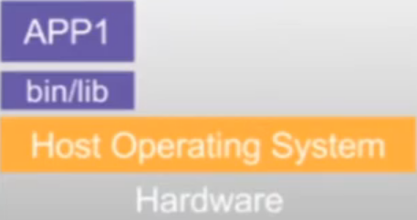
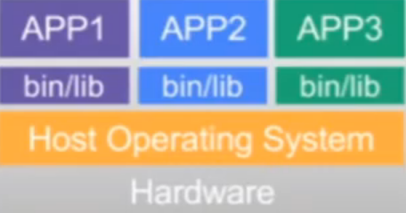
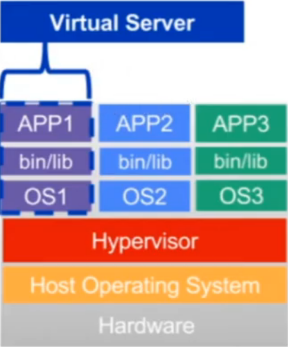
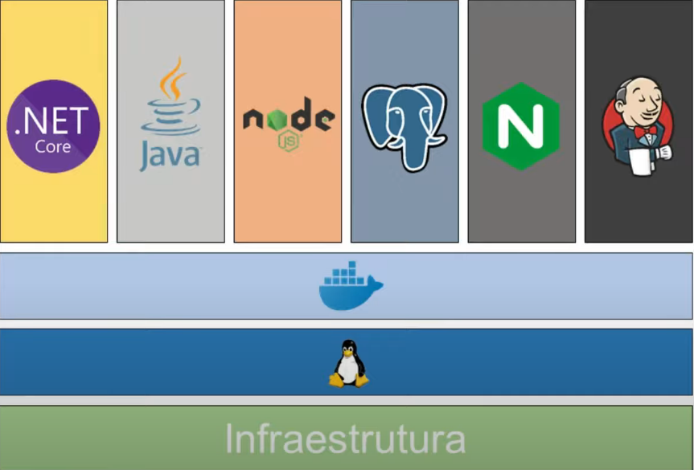

# VM e container 

### VM

> VM é um acrônimo para (V)irtual (M)achine

* **Caso 1 (1 aplicação = 1 servidor)**

  

  * **Problemas**

    * **Custo elevado** na manutenção e recursos da máquina

    * **Escalonamento vertical**

      > Escalonamento vertical é a ação de aumentar os recursos utilizados, como por exemplo CPU e memória.

    * **_Downtime_ elevado**

* **Caso 2 (OS compartilhado)**

  

  * **Vantagens em relação ao "caso 1"**

    * **Redução no custo**

  * **Problemas**

    * **Falta de isolamento de dependências e serviços** após alguma atualização de uma das aplicações

    * **Dificuldade nas trocas de versões da aplicação**

    * **_Downtime_ elevado**

* **Caso 3 (Virtual Server)**

  

  * **Vantagens**

    * **Maior isolamento entre aplicações** (OS / binários para cada aplicação)

    * A partir do _Hypervisor_ é possível salvar **_snapshots_ da imagem da VM** (facilidade na persistência e gerenciamento de backups)

    * **Redução no _downtime_** entre atualizações

### Container

* **Características**

  * Substituição do Hypervisor por um Container Engine (Exemplo: Docker Engine)

    > A virtualização com um Container Engine é em nível de sistema operacional

  * Imutabilidade das imagens (em caso de alteração da imagem, é necessário recriá-la)

* **Vantagens**

  * **Simplificação na gestão** (1 único sistema operacional e os _container runtime_ o simula)

  * **Economia de recurso**

  * **Controle de memória e CPU** para cada container

  * **Troca das versões facilidade** e **sem _downtime_** entre as as atualizações