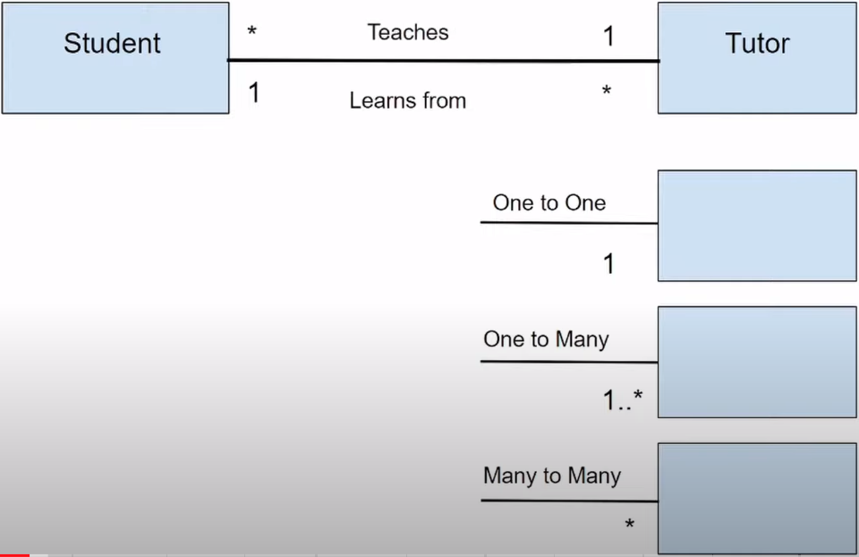

# Diagrama de classes

> ## **Estrutura**

### **Nome da classe**

### **Atributos**

### **Métodos**

> ## **Modificadores de acesso**

- `-`: privado

- `+`: público

- `#`: protected

- `~`: _default_ (visível apenas para o pacote da classe)

> ## **Relações entre classes**

### **Associação**

### **Generalização ou Herança**

Relação entre classes concretas e abstratas

**OBS**: classes abstratas são escritas em _itálico_

### **Refinamento**

Relação entre classes e interfaces.

### **Dependência**

### **Agregação**

### **Composição**

É um tipo de agregação.

