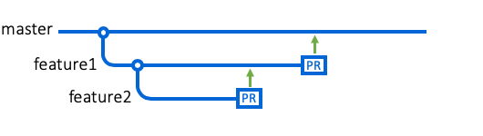
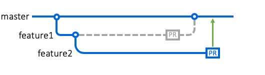

# Branches

### Definição

* Isolar o trabalho de desenvolvimento sem afetar outras branches de um repositório

* Cada repositório possui uma branch padrão

* É possível criar várias ramificações a partir da branch padrão ou de outra branch

  

* A junção de 2 branches é feita através de um [*pull request*](https://docs.github.com/pt/github/collaborating-with-pull-requests/proposing-changes-to-your-work-with-pull-requests/about-pull-requests)

  

### Branches: "main" e "master"

* São nomes dados a branch padrão de um repositório

* A branch "master" é o nome utilizado nas versões mais antigas do Git

* Atualmente, o Git e GitHub estão adotando o nome "main" para a branch principal

## Branch padrão

* É gerado automaticamente ao criar um novo repositório

* Será exibido quando um usuário entrar em um repositório do GitHub

* Será utilizada ao clonar um repositório do GitHub