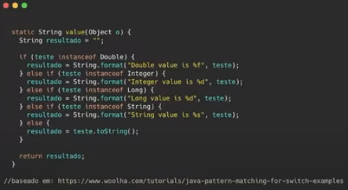
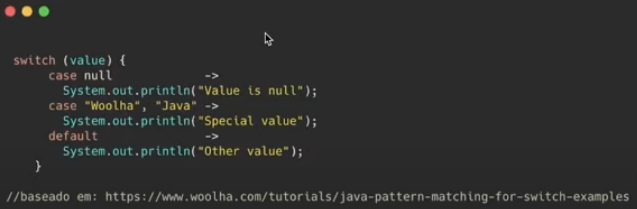
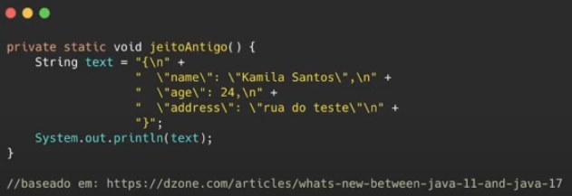
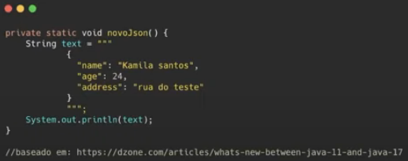
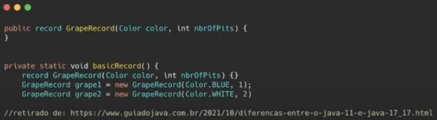
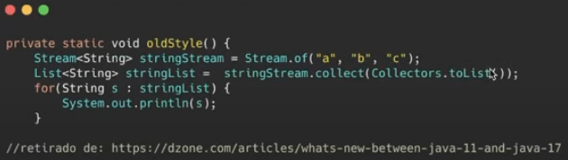
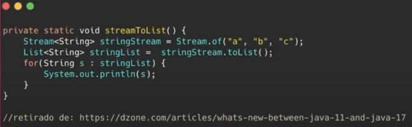

# Java 17

### Novidades

* **Sealed class (classe selada)**

  * Veio com o JEP 409

    > JEP = JDK Enhancement Proposal

  * Restringir quais classe podem herdar de uma classe mãe, ou seja, as classes só serão estendidas pelas classes que tiverem permissão para isso (`permission`)

  * Modificador `sealed`: tornar uma classe selada

  * Cláusula `permission`: especificar as classes que têm permissão para estender uma classe selada

  * **Exemplo**

    

* **Pattern Matching for `switch`** (preview)

  * Tornar a instrução `switch` muito mais programável e flexível, permitindo a implementação de padrões nos blocos `case` do `switch`

  * Essa funcionalidade está disponível apenas para tipos numéricos, `enum` e `String`

  * **OBS**: é possível apenas testar igualdades exatas (`==`) em relação às constantes

  * É possível tratar de modo mais simples condições de valores nulos (`null`)

    * **Sem Pattern Matching**

      

    * **Com Pattern Matching**

      

### Mudanças entre as versões LTS: Java 11 e Java 17

* **Triple quotes**

  * Facilitar a manipulação de String, principalmente ao escrever uma String JSON

  * Java 11

    

  * Java 17

    

* **Records**

  * Criar classes imutáveis e com a geração automática de construtores, getters, setters, equals e hashcode

  * Java 11

    * Era necessário crias todos esses métodos manualmente ou via IDE

    * Utilização da biblioteca **Lombok**

  * Java 17

    

* **Stream to List**

  * Conversão um Stream para uma List

  * Java 11

    

  * Java 17

    