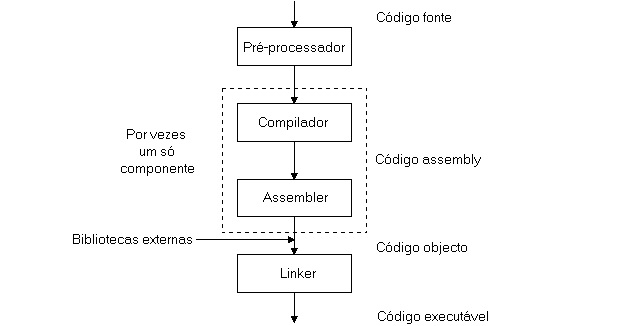
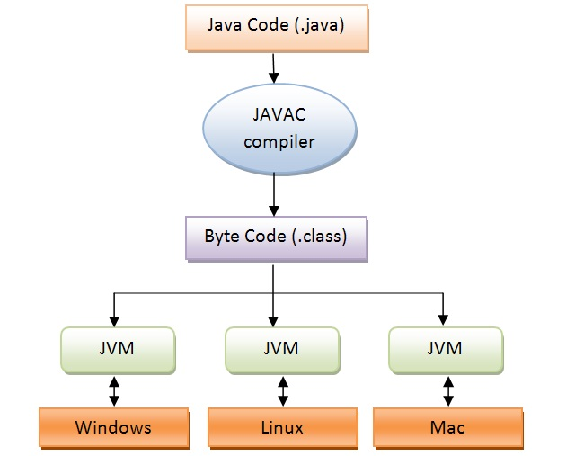

# JVM

### Definição

* JVM = *Java Virtual Machine*

* É uma máquina virtual responsável pela tradução dos *Bytes Codes* (arquivos `.class`) oriundos da compilação do código fonte em código de máquina de cada sistema operacional (arquivos binários)

  > A compilação é feita pela *Javac* (Java Compiler)

* Compilação do código fonte em código de máquina

  * Exemplo C/C++

    

  * Exemplo Java

    

### Função

* Execução de pilhas

* Gerenciamento de memória (alocação de memória)

* Gerenciamento de threads

* Otimização de código fonte (Compilação JIT)

  > JIT = Just in Time

* Garbage Collector (GC)

### JRE vs JDK

* **JRE**

  * JRE = *Java Runtime Environment*

  * Responsável por executar os programas em Java

* **JDK**

  * JDK = *Java Development Kit*

  * Utilitário que permite o desenvolvimento de programas em Java

  * **OBS**: JRE já vem embutido no JDK

### Plataformas

* **Java SE**
  
  * Java SE = *Java Standard Edition*

  * Contém as especificações do Java e pode ser implementado por diversas empresas como Oracle, OpenJDK, Azul Zulu, entre outros

  * Principais implementações do Java SE

    * OpenJDK

    * Oracle JDK

    * AdoptOpenJDK

    * Amazon Corretto

    * GraalVM CE

    * Azul Zulu

* **Java EE**

  * Java EE = *Java Enterprise Edition*

  * Contém todas as especificações do Java SE, além de conter alguns programas para facilitar execução em servidores

  * **OBS**: em 2019 foi renomeado para *Jakarta EE*

* **Java ME**

  * Java ME = *Java Micro Edition*

  * Contém as especificações para desenvolvimento de dispositivos móveis/embarcados como celulares, PDAs, entre outros