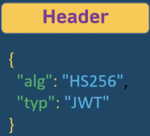
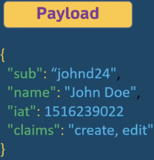
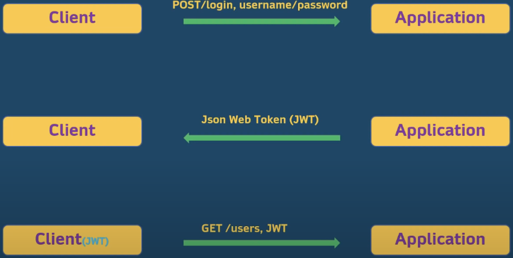

# JWT

### Definição

* **JWT** = JSON Web Token

### Autenticação VS Autorização 

* **Autenticação**

  * **Definição**: validar a identidade de uma pessoa

  * **Métodos de autenticação**: formulário de login, *HTTP authentication* ou *HTTP authentication* customizada

* **Autorização**

  * **Definição**: permissões concedidas a uma pessoa/grupo de pessoas

  * **Métodos de autorização**: URLs de controle de acesso, lista de controle de acesso (*ACLs*)

### Estrutura do JWT

* **Header**: algoritmo e tipo

  

* **Payload**: contém informações do dono do token (permissões, autorizações, informações do proprietário do token)

  

* Signature: informações do header e payload encriptadas 

  

  

### Fluxo de uma requisição com JWT



### Implementação com Spring Security

* **Criação da classe AppUser**

  * **OBS**: no Spring Security existe uma classe com nome *User* e para evitar conflitos, o nome padrão  para essa classe na aplicação é *AppUser*

  * **Campo `username`**: é comum utilizar email ou nome do usuário 

  * **Exemplo**

    ```java
    @Entity
    @NoArgsConstructor
    @AllArgsConstructor
    @Data
    public class AppUser {

        @Id
        @GeneratedValue(strategy = IDENTITY)
        private Long id;

        private String name;

        private String username;

        private String password;

        @ManyToMany(fetch = EAGER)
        private Collection<Role> roles = new ArrayList<>();

    }
    ```

    > `fetch = EAGER`: ao fazer carregar o usuário(s), as *Roles* relacionadas com esse usuário serão carregadas também

* **Criação da classe Role**

  ```java
  @Entity
  @NoArgsConstructor
  @AllArgsConstructor
  @Data
  public class Role {

      @Id
      @GeneratedValue(strategy = IDENTITY)
      private Long id;
      
      private String name;

  }
  ```

* **Criação da camada de acesso ao banco de dados (*UserRepository* e *RoleRepository*)**

  ```java
  public interface UserRepository extends JpaRepository<AppUser, Long> {

      AppUser findByUsername(String username);

  }
  ```

  ```java
  public interface RoleRepository extends JpaRepository<Role, Long> {

      Role findByName(String name);

  }
  ```

* **Criação da camada de serviço (*UserService*)**

  ```java
  public interface UserService {

      AppUser saveUser(AppUser appUser);

      Role saveRole(Role role);

      void addRoleToUser(String username, String roleName);

      AppUser getUser(String username);

      List<AppUser> getUsers();

  }
  ```

  ```java
  @Service
  @Transactional
  @Slf4j
  @RequiredArgsConstructor(onConstructor = @__(@Autowired))
  public class UserServiceImpl implements UserService {

      private final UserRepository USER_REPOSITORY;
      private final RoleRepository ROLE_REPOSITORY;

      @Override
      public AppUser saveUser(AppUser appUser) {
          appUser.setPassword(PASSWORD_ENCODER.encode(appUser.getPassword()));

          return USER_REPOSITORY.save(appUser);
      }

      @Override
      public Role saveRole(Role role) {
          return ROLE_REPOSITORY.save(role);
      }

      @Override
      public void addRoleToUser(String username, String roleName) {
          AppUser appUser = USER_REPOSITORY.findByUsername(username);
          Role role = ROLE_REPOSITORY.findByName(roleName);

          appUser.getRoles().add(role);

          // Por esta classe estar anotado com @Transactional, qualquer alteração na entidade é salva automaticamente
      }

      @Override
      public AppUser getUser(String username) {
          return USER_REPOSITORY.findByUsername(username);
      }

      @Override
      public List<AppUser> getUsers() {
          return USER_REPOSITORY.findAll();
      }
  }
  ```

  * **Usuário e senha padrão do Spring Security**

    * **Usuário**: `user`

    * **Senha**: gerada automaticamente e impressa no console

    * **Fazer login**: `localhost:8080/login`

  * **Configurações de autenticação e URLs de controle de acesso**

    ```java
    @Configuration
    @EnableWebSecurity
    @RequiredArgsConstructor(onConstructor = @__(@Autowired))
    public class SecurityConfig extends WebSecurityConfigurerAdapter {

        private final UserDetailsService USER_DETAILS_SERVICE;
        private final BCryptPasswordEncoder B_CRYPT_PASSWORD_ENCODER;

        @Override
        protected void configure(AuthenticationManagerBuilder auth) throws Exception {
            auth.userDetailsService(USER_DETAILS_SERVICE)
                    .passwordEncoder(B_CRYPT_PASSWORD_ENCODER);
        }

        @Override
        protected void configure(HttpSecurity http) throws Exception {
            CustomAuthenticationFilter customAuthenticationFilter = new CustomAuthenticationFilter(authenticationManagerBean());
            customAuthenticationFilter.setFilterProcessesUrl("/api/login");

            http.csrf().disable();
            http.sessionManagement().sessionCreationPolicy(STATELESS);

            http.authorizeRequests().antMatchers("/api/login/**").permitAll();
            http.authorizeRequests().antMatchers(GET, "/api/users/**").hasAuthority("ROLE_USER");
            http.authorizeRequests().antMatchers(POST, "/api/users/**").hasAuthority("ROLE_ADMIN");
            http.authorizeRequests().anyRequest().authenticated();

            http.addFilter(customAuthenticationFilter);
        }

        @Bean
        @Override
        public AuthenticationManager authenticationManagerBean() throws Exception {
            return super.authenticationManagerBean();
        }
    }
    ```

  * **Adicionar *filters***

    * `attemptAuthentication`: esse método será chamado toda vez que um usuário tentar logar

    * `successfulAuthentication`: esse método será chamada quando o usuário logar com sucesso

    ```java
    @Slf4j
    @RequiredArgsConstructor(onConstructor = @__(@Autowired))
    public class CustomAuthenticationFilter extends UsernamePasswordAuthenticationFilter {

        private final AuthenticationManager AUTHENTICATION_MANAGER;

        @Override
        public Authentication attemptAuthentication(
                HttpServletRequest request,
                HttpServletResponse response
        ) throws AuthenticationException {
            String username = request.getParameter("username");
            String password = request.getParameter("password");

            log.info("Username is: {}", username);
            log.info("Password is: {}", password);

            UsernamePasswordAuthenticationToken authenticationToken = new UsernamePasswordAuthenticationToken(username, password);

            return AUTHENTICATION_MANAGER.authenticate(authenticationToken);
        }

        @Override
        protected void successfulAuthentication(
                HttpServletRequest request,
                HttpServletResponse response,
                FilterChain chain,
                Authentication authentication
        ) throws IOException, ServletException {
            User user = (User) authentication.getPrincipal();

            Algorithm algorithm = Algorithm.HMAC256("secret".getBytes());

            String access_token = JWT.create()
                    .withSubject(user.getUsername())
                    .withExpiresAt(new Date(System.currentTimeMillis() + 10 * 60 * 1_000))
                    .withIssuer(request.getRequestURI())
                    .withClaim(
                            "roles",
                            user.getAuthorities().stream()
                                    .map(GrantedAuthority::getAuthority)
                                    .collect(Collectors.toList())
                    )
                    .sign(algorithm);
            String refresh_token = JWT.create()
                    .withSubject(user.getUsername())
                    .withExpiresAt(new Date(System.currentTimeMillis() + 30 * 60 * 1_000))
                    .withIssuer(request.getRequestURI())
                    .sign(algorithm);

            Map<String, String> tokens = new HashMap<>() {{
                put("access_token", access_token);
                put("refresh_token", refresh_token);
            }};

            response.setContentType(APPLICATION_JSON_VALUE);
            new ObjectMapper().writeValue(response.getOutputStream(), tokens);
        } 
    }
    ```

    * **Access Token**: geralmente, possuem data de expiração baixa (no máximo algumas horas)

    * **Refresh Token**: geralmente, possuem data de expiração bem maior em relação ao *Access Token* (até 6 meses)

    * Verificar o conteúdo de um token JWT: https://jwt.io/

    > **OBS**: "secret", em ambiente de produção, **NÃO DEVE** estar hard coded (SOLUÇÃO: encriptar e desencriptar "secret" a partir de classe utilitária)

  * **Permitir requisições conforme as permissões do token JWT do usuário**

    ```java
    @Slf4j
    public class CustomAuthorizationFilter extends OncePerRequestFilter {

      @Override
      protected void doFilterInternal(
              HttpServletRequest request,
              HttpServletResponse response,
              FilterChain filterChain
      ) throws ServletException, IOException {
          if (request.getServletPath().equals("/api/login") || request.getServletPath().equals("/api/token/refresh")) {
              filterChain.doFilter(request, response);
              return;
          }

          String authorizationHeader = request.getHeader(AUTHORIZATION);

          if (authorizationHeader == null || !authorizationHeader.startsWith("Bearer ")) {
              filterChain.doFilter(request, response);
              return;
          }

          try {
              String token = authorizationHeader.substring("Bearer ".length());

              Algorithm algorithm = Algorithm.HMAC256("secret".getBytes());
              JWTVerifier verifier = JWT.require(algorithm).build();

              DecodedJWT decodedJWT = verifier.verify(token);

              String username = decodedJWT.getSubject();
              String[] roles = decodedJWT.getClaim("roles").asArray(String.class);

              List<SimpleGrantedAuthority> authorities = stream(roles)
                      .map(SimpleGrantedAuthority::new)
                      .collect(Collectors.toList());

              UsernamePasswordAuthenticationToken authenticationToken = new UsernamePasswordAuthenticationToken(
                      username,
                      null,
                      authorities
              );
              SecurityContextHolder.getContext().setAuthentication(authenticationToken);

              filterChain.doFilter(request, response);

          } catch (Exception e) {
              log.error("Error logging in: {}", e.getMessage());

              Map<String, String> tokens = new HashMap<>() {{
                  put("error", e.getMessage());
              }};

              response.setContentType(APPLICATION_JSON_VALUE);
              response.setStatus(FORBIDDEN.value());
              new ObjectMapper().writeValue(response.getOutputStream(), tokens);
          }
      }

    }
    ```

    > Toda requisição passará pelo método `doFilterInternal`, que por sua vez fará a verificação das permissões do usuário e permitir o acesso a um determinado recurso da aplicação (**autorização**)