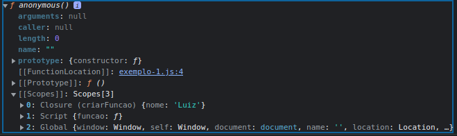

# Closures

> ## **Definição**

É a capacidade de um função em **acessar o seu escopo léxico**.

> ## **Exemplo**

```js
function criarFuncao() {
  const nome = "Luiz";

  return function () {
    return nome;
  };
}

const funcao = criarFuncao();
console.dir(funcao);
```


