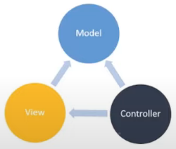

# Introdução ao Nest.js

> ## **Definição**

É uma framework opinativo, ou seja, o Nest fornece aos desenvolvedores alguns padrões de projetos para facilitar a tomada de decisão no desenvolvimento e obter uma maior produtividade.

> ## **Características**

Baseado na arquitetura MVC (arquitetura de camadas):

  

- **Controller** (`@Controller`): responsável pelo controle de fluxo dos dados (entrada e saída) da aplicação

- **Service** (`@Service`): engloba todo o resto

- **Module** (`@Module`): responsável pela configuração do módulo, ou seja, definir _imports_, _controllers_ e _providers_ para a injeção de dependência

Typescript em ambiente de desenvolvimento.

Baseado nas ideais arquiteturais do Angular.

Arquitetura fornecido pelo NestJS respeitando os princípios do SOLID

- [**Inversão de dependência**](dependency-inversion.md)

- [**Injeção de dependência**](#injeção-de-dependência)

> ## **Vantagens**

- CoC (_Convention Over Configuration_)

  > Sugestão de padrão de nomenclatura de arquivos/diretórios.

- Typescript

  - Linguagem fortemente tipada

  - Aparição de erros durante o desenvolvimento

  - Mais recursos/funcionalidades do que o JavaScript puro

  - Decorators

- Arquitetura escalável (baseada no Angular)

  - Modularidade

  - Injeção de dependência

  - Padrão de nomenclatura de arquivos e diretórios

- Integração fácil com vários tipos de banco de dados

- Suporte a microsserviços

- Suporte à criação de _API Rest_, _GraphQL_

> ## **"O que o Nest.js não é?"**

- Angular

- React

- Vue

- Um framework de front-end

> ## **"Conselhos ao utilizar o Nest.js"**

- Não depender exclusivamente a um framework

- Não pular etapas (estudar e fixar os fundamentos da linguagem, no caso JavaScript)

  
