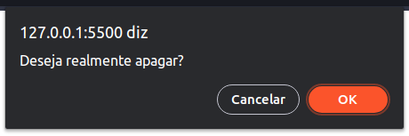
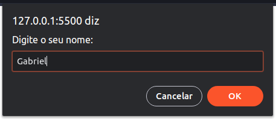

# Meios de exibir dados para o usuário

> ## Método `console.log()`

### **Função**

Imprimir um valor na tela do terminal (*console*).

### **Sintaxe**

```js
console.log([objeto], [valor]);
```

### **Exemplo**

* Imprimir uma `string` no *console*:

  ```js
  console.log("Luiz Otávio"); // Luiz Otávio
  
  console.log('Luiz Otávio'); // Luiz Otávio

  console.log(`Luiz Otávio`); // Luiz Otávio
  ```

* Imprimir as aspas em uma `string` no console:

  ```js
  console.log("Luiz 'Otávio'"); // Luiz 'Otávio'

  console.log('Luiz "Otávio"'); // Luiz 'Otávio'
  ```

  > **Conclusão**: para utilizar aspas dentro de uma `string` é necessário utilizar **um tipo de aspas para declarar a String** e **a outra para ser impressa no console**.

* Imprimir um número no *console*:

  ```js
  console.log(123456) // 123456 = Number
  ```

  > **IMPORTANTE**: não utilizar aspas (simples ou duplas), pois com isso o número é convertido em `string`.

* Imprimir uma sequência de valores sem pular linha:

  ```js
  console.log(12, 15.85, "Luiz Otávio"); // 12 15.85 Luiz Otávio
  ```

---

> ## Método `alert()`

### **Definição**

* `alert()` é um atalho para o método `window.alert()`.

* Esse método está disponível apenas no navegador.

### **Sintaxe**

```js
alert([mensagem]);
```

### **Exemplo**


---

> ## Método `confirm()`

### **Definição**

* `confirm()` é um atalho para o método `window.confirm()`.

* Essa função retorna um valor booleano, sendo `true` quando o usuário clicar no botão `OK` e `false` quando ele clicar no botão `Cancelar`.

* Esse método está disponível apenas no navegador.

### **Sintaxe**

```js
confirm([mensagem]);
```

### **Exemplo**



---

> ## Método `prompt()`

### **Definição**

* `prompt()` é um atalho para método `window.prompt()`.

* Esse método retorna o valor inserido na caixa de texto da janela do `prompt`.

* Esse método está disponível apenas no navegador.

### **Sintaxe**

```js
prompt([mensagem]);
```

### **Exemplo**

