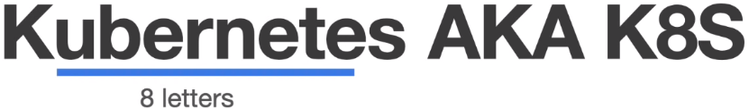
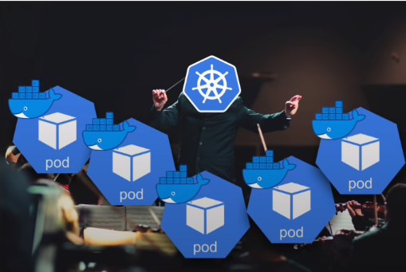

# Introdução ao Kubernetes

### Definição

> "Kubernetes é uma plataforma de código aberto, portável e extensiva para gerenciamento de cargas de trabalho e serviços distribuídos em containers, que facilita tanto a configuração declarativa quanto automação." - [Mantenedores](https://kubernetes.io/pt-br/docs/concepts/overview/what-is-kubernetes/)

* Orquestrador (gerência e entrega) de aplicações (*containers*)

  

* É um framework de infraestrutura **para containers**, [**declarativo**](./imperativo-declarativo.md) (arquivos `.yaml`) e operado de maneira **autónoma** por meio dos *controllers*

### Vantagens

* Economia de recursos com a capacidade de escalar a aplicação de acordo com a demanda

* Implantação e atualização sem *downtime*

* Facilidade na realização de *rollbacks*

### Cluster

* É um conjunto de *nodes*

* *Node* = Virtual Machine (VM) ou máquina física

* **Exemplos**

  * AWS, Azure, Google Cloud

  * Ambientes *On-promises*

### Cluster Kubernetes

* **Master**: responsável pelas tomadas de decisões

  * [**Controller**](./controller.md)

* **Node**: responsável por rodar a aplicação (*container*)

* *Master* e *node(s)* se comunicam entre si

### Objetos

* Pods

* Services

* Deployments

### Ferramentas

* **Minikube**

  * **Função**: criar *Kubernetes clusters* localmente (ambiente *On-promises*)

  * **Vantagens**

    * Boa comunidade

    * Várias funcionalidades e add-ons

    * Boa documentação

  * **Instalação**: *Docker* + *Minikube*

* **Kubectl (Kube control)**

  * **Função**: um ferramenta CLI para gerenciar *Kubernetes clusters*

  * **Algumas ações com Kubectl**

    * Deploy

    * Inspecionar

    * Editar recursos

    * Depurar

    * Ver logs

