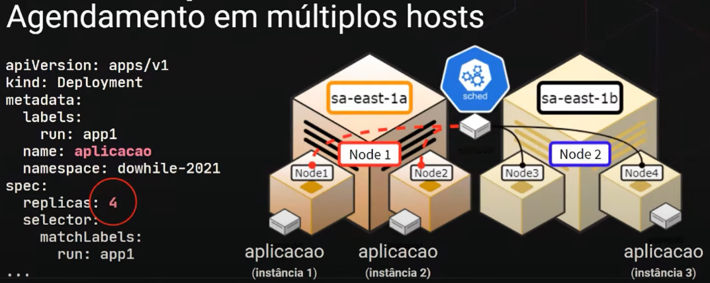
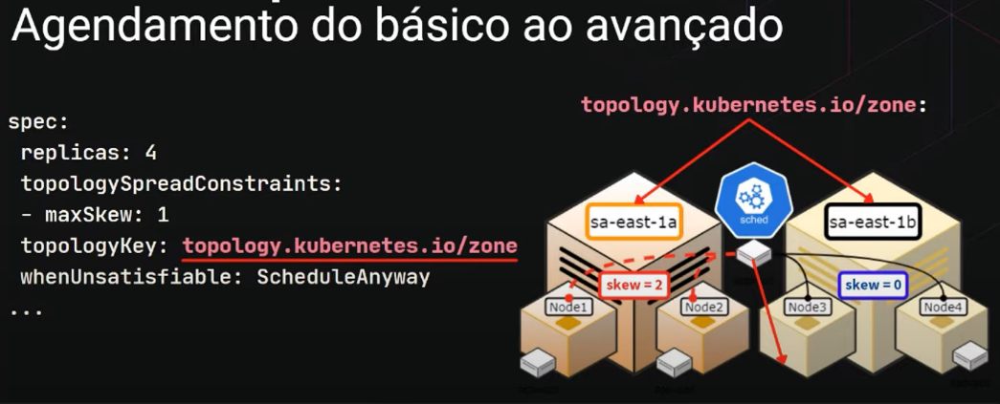
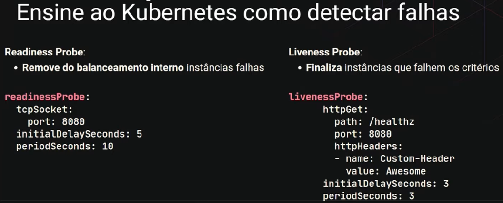
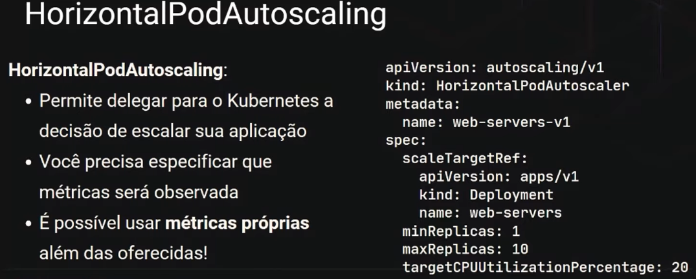
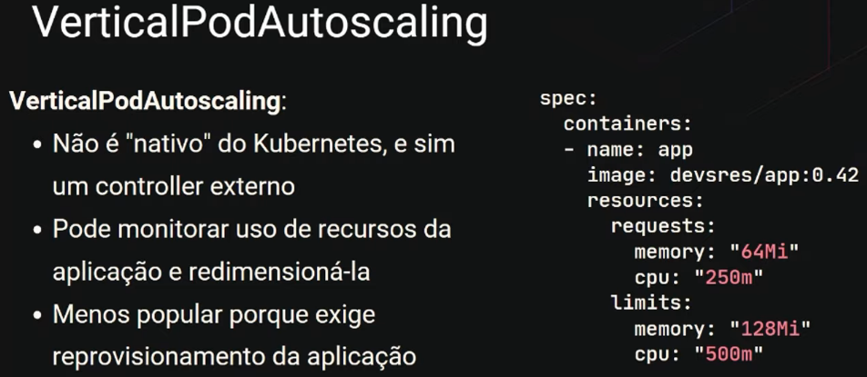
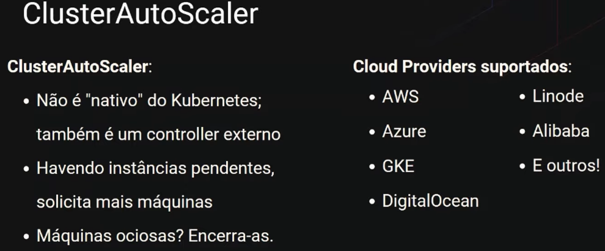

# Introdução ao Kubernetes

> ## Kubernetes

### **Definição**

> "Kubernetes é uma plataforma de código aberto, portável e extensiva para gerenciamento de cargas de trabalho e serviços distribuídos em containers, que facilita tanto a configuração declarativa quanto automação." - [Mantenedores](https://kubernetes.io/pt-br/docs/concepts/overview/what-is-kubernetes/)

* Orquestrador (gerência e entrega) de aplicações (*containers*)

  

* É um framework de infraestrutura **para containers**, [**declarativo**](./imperativo-declarativo.md) (arquivos `.yaml`) e operado de maneira **autónoma** por meio dos *controllers*

### **Objetos principais**

* Pods

* Services

* Deployments

### **Vantagens**

* Economia de recursos com a capacidade de escalar a aplicação de acordo com a demanda

* Implantação e atualização sem *downtime*

* Facilidade na realização de *rollbacks*

* **Interface agradável para desenvolvedores**

  > "É uma framework **declarativo** para **containers** operado de maneira autónoma por ***containers*** que viabiliza a **interface** entre as equipes de **desenvolvimento** e da **infraestrutura** que hospedará suas aplicações"

* **Alta disponibilidade**

  

  

  

  > Auto diagnóstico
  

  > Load Balancer
  

* **Escalabilidade**
  
  

  

  

---

> ## Cluster

### **Definição**

* É um conjunto de *nodes*

* *Node* = Virtual Machine (VM) ou máquina física

### **Exemplos**

* AWS

* Azure

* Google Cloud Platform

* Ambientes *On-promises* (máquinas físicas com Kubernetes)

### **Cluster Kubernetes**

* **Master**: responsável pelas tomadas de decisões

  * [**Controller**](./controller.md)

* **Node**: responsável por rodar a aplicação (*container*)

* *Master* e *node(s)* se comunicam entre si

---

> ## Ferramentas

* **Minikube**

  * **Função**: criar *Kubernetes clusters* localmente (ambiente *On-promises*)

  * **Vantagens**

    * Boa comunidade

    * Várias funcionalidades e add-ons

    * Boa documentação

  * **Instalação**: *Docker* + *Minikube*

* **Kubectl (Kube control)**

  * **Função**: um ferramenta CLI para gerenciar *Kubernetes clusters*

  * **Algumas ações com Kubectl**

    * Deploy

    * Inspecionar

    * Editar recursos

    * Depurar

    * Ver logs

