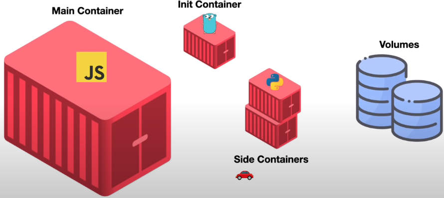

# Pods no Kubernetes

### Definição

* É a menor unidade de *deploy* no Kubernetes

* 1 pod pode ter vários *containers*

### Tipos de *containers* dentro do *Pod*

* **Main container**: container principal da aplicação

* [**Init container**](https://kubernetes.io/docs/concepts/workloads/pods/init-containers/): é o primeiro a ser iniciado e outros *containers* só são iniciados após a inicialização bem sucedida do *init container*

* **Side container**: são *containers* dão suporte ao **main container**

### Volumes

* É a forma de como os containers compartilham dados entre si

### Network

* **localhost**: meio de comunicação entre os *containers* do mesmo *Pod*

* **Endereço de IP do Pod**: meio de comunicação com outra(s) aplicação(ões) é feita a partir de um IP único (`10.0.10.1`)