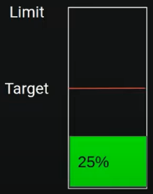
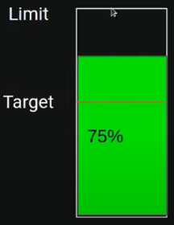
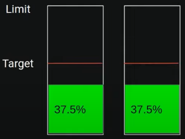
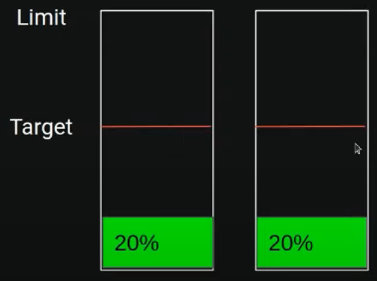
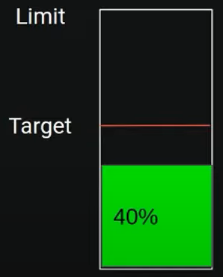

# Recursos no Kubernetes

### CPU

* **Definição**: ações feitas pela aplicação

* **Exemplos**: contas, transformações, comparações, iterações

### Memória

* **Definição**: estado da aplicação

* **Exemplos**: variáveis, constantes, objetos, listas

### Escassez de recursos

* **Falta de CPU**: aplicação fica lenta (a ações demoram para ser processadas)

* **Falta de Memória**: aplicação trava (exceção `OutOfMemoryError` é lançada)

### Aplicações dividindo um mesmo hardware

* **Solução**: limitação de recursos (CPU e memória)

  * **No Kubernetes**

    * Para limitar a CPU, o K8S utiliza o **CPU throttling** o que provoca uma lentidão na aplicação

    * Para limitar a memória, o K8S utiliza o **OOM Killer** (*Out Of Memory Killer*) causando um loop de reinicialização da aplicação

### Otimização de recursos com HPA (*Horizontal Pod Autoscaler*)

* **Configuração do HPA**

  * 1º passo: instalar o **metrics server**

    > **Metrics Server**: tirar métricas de todos os pods dentro do Cluster e expor esse dados em uma API já integrada ao Kubernetes

  * 2º passo: determinar recursos para 1 pod

    > Para auxiliar na distribuição de recursos para cada Pod, é recomendável utilizar uma biblioteca de **stress**, como por exemplo: [vegeta](https://github.com/tsenart/vegeta)

  * 3º passo: determinar parâmetros de escala

* **Funcionamento do HPA**

  

  * **Target** = alvo de CPU que um Pod deve manter, ou seja, o Kubernetes, então, tenta manter a utilização de CPU em 50% do limite (**target**)

  

  * Com a utilização de CPU ultrapassando o alvo de CPU (**target**) especificado no arquivo `deployment.yaml` do K8S, o Kubernetes irá criar novos Pods (**distribuir a carga**) afim de manter a utilização de CPU até no máximo ao **target** em todos os Pods afetados por esse `deployment.yaml`

  

  

  * Com o fim do período de estresse da aplicação (redução no número de requisições), o Kubernetes ao verificar que a soma das percentagens de utilização de CPU for abaixo do **target** de um dos Pods, então ele irá destruir os Pods excedentes

  