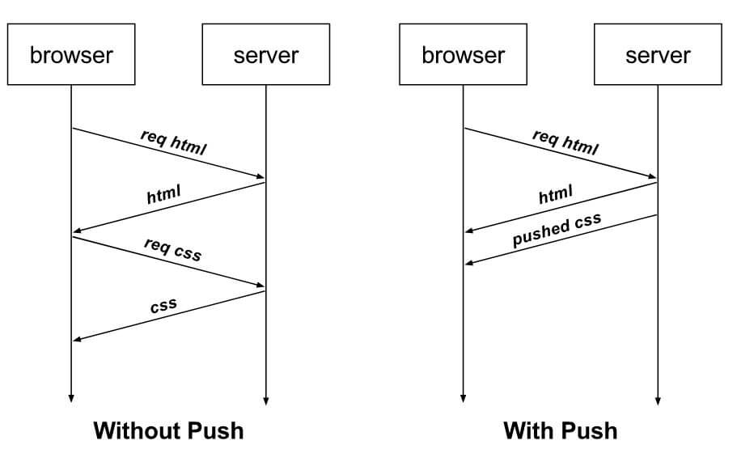

# Introdução à HTTP/2

> ## **Definição**

Lançado em 2015 pela Google.

Os dados são trafegados em binário e não *plain tet* como no *HTTP/1*. Além disso os *headers* são comprimidos.

Utiliza a mesma conexão *TCP* para enviar e receber dados do cliente e do servidor (**Fluxo multiplexados**).

A comunicação é feita baseado em **Server Push**:

> ## **Curiosidade**

O nome dado ao HTTP/2 originalmente era *SPDY*.

> ## **Vantagens**

* Economia de recurso de rede

* Extremamente veloz no processamento dos dados
