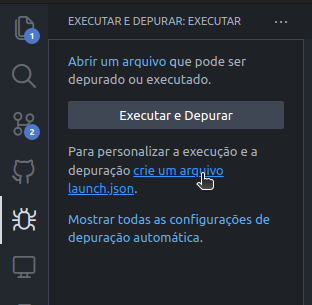
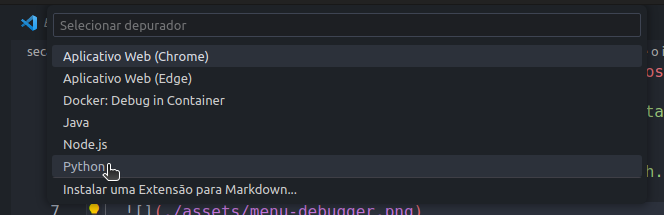
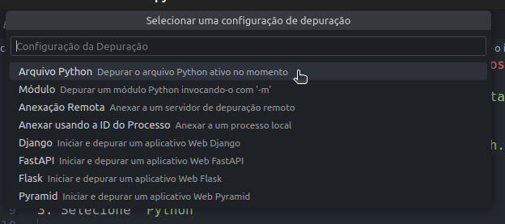
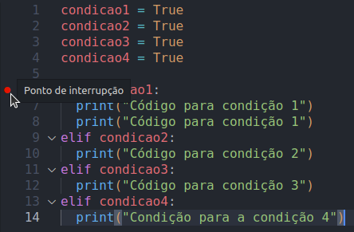
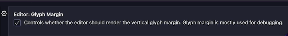
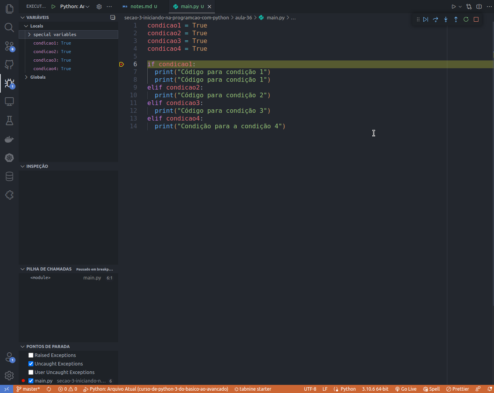

# Debugger do VS Code

1. Vá na barra lateral no VS Code e selecione a aba `Executar e Depurar` ou utilize o atalho `SHIFT + ALT + F9`

2. Configure o ambiente clicando em `crie um arquivo launch.json`

   

3. Selecione `Python`

   

4. Selecione a opção `Arquivo Python`

   

5. Então o arquivo `launch.json` será criado de forma automaticamente no diretório `.vscode`, contendo as seguintes configurações:

   ```json
   {
     // Use o IntelliSense para saber mais sobre os atributos possíveis.
     // Focalizar para exibir as descrições dos atributos existentes.
     // Para obter mais informações, acesse: https://go.microsoft.com/fwlink/?linkid=830387
     "version": "0.2.0",
     "configurations": [
       {
         "name": "Python: Arquivo Atual",
         "type": "python",
         "request": "launch",
         "program": "${file}",
         "console": "integratedTerminal",
         "justMyCode": true
       }
     ]
   }
   ```

6. Agora vá para o arquivo `.py` que você deseja debugar e clique na margem do começo da linha na qual deseja realizar o debug:

   

   > Quando você clicar uma bola vermelha aparecerá aonde você clicou, indicando a linha que será depurada

7. (Opcional) Caso não esteja aparecendo a bola vermelha, já nas configurações do VS Code e procure por `Glyph Margin` e habilite essa opção.

   

8. Por fim, iniciar a depuração pressionado a tecla `F5`

   
