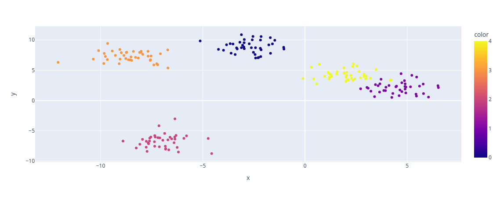

A função `make_blobs` do módulo `sklearn.datasets` é uma função conveniente para a geração de conjuntos de dados sintéticos usados principalmente para fins de testes e experimentação em aprendizado de máquina e análise de dados. Ela permite criar conjuntos de dados com grupos (clusters) de pontos distribuídos de forma gaussiana, tornando-os úteis para tarefas de agrupamento e classificação.

## Sintaxe

```python
sklearn.datasets.make_blobs(n_samples=100, n_features=2, centers=3, cluster_std=1.0, center_box=(-10.0, 10.0), shuffle=True, random_state=None)
```

### Principais parâmetros

- `n_samples` (int): O número total de pontos de dados a serem gerados. Cada ponto é uma observação ou exemplo do conjunto de dados.

- `n_features` (int): O número de recursos (ou dimensões) em cada ponto de dados. Isso define a dimensionalidade dos dados.

- `centers` (int ou array-like): O número de clusters a serem gerados ou uma matriz que especifica a localização dos centros dos clusters. Se for um número inteiro, ele cria esse número de clusters aleatoriamente. Se for uma matriz, você especifica manualmente as coordenadas dos centros dos clusters.

- `cluster_std` (float ou sequência de floats): O desvio padrão dos clusters gerados. Um valor maior indica que os pontos dentro de um cluster terão maior dispersão. Pode ser um único valor flutuante ou uma lista de flutuantes, um para cada cluster.

- `center_box` (tuple): Uma tupla que especifica o intervalo de valores das coordenadas dos centros dos clusters. Isso é útil quando você especifica manualmente os centros dos clusters.

- `shuffle` (bool): Se True, os pontos de dados são embaralhados aleatoriamente.

- `random_state` (int ou RandomState, opcional): Controla a aleatoriedade na geração de dados. Se definido como um número inteiro, produzirá resultados reproduzíveis se o mesmo valor for usado em chamadas posteriores.

### Retorno

A função `make_blobs` retorna uma tupla contendo dois elementos:

1. Uma matriz NumPy de forma `(n_samples, n_features)` que contém os pontos de dados gerados.
2. Uma matriz NumPy de forma `(n_samples,)` que contém os rótulos ou identificadores de cluster para cada ponto de dados. Cada rótulo corresponde a um cluster.

## Exemplo

```python
from sklearn.datasets import make_blobs
import matplotlib.pyplot as plt

# Gerar dados sintéticos com 3 clusters
X_random, y_random = make_blobs(n_samples=200, centers=5, random_state=42)

# Plotar os dados gerados
px.scatter(x = X_random[:, 0], y = X_random[:, 1], color=y_random)
```

Saída:



Neste exemplo, a função `make_blobs` foi usada para gerar um conjunto de dados com 200 pontos distribuídos em 5 clusters. Os dados são então plotados com cores diferentes para cada cluster. Isso é útil para visualizar conjuntos de dados de clusters e testar algoritmos de aprendizado de máquina relacionados ao agrupamento.