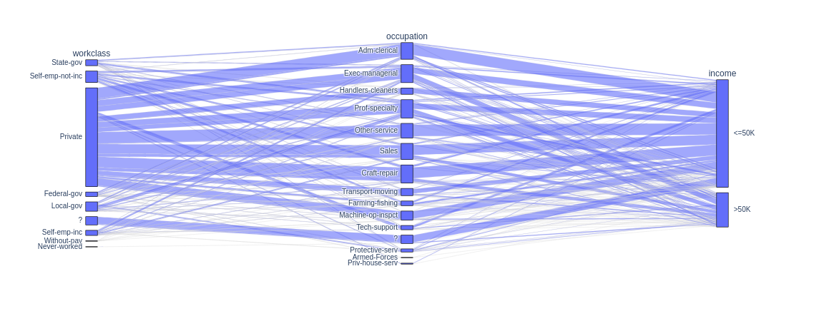

# Função `parallel_categories`

A função `parallel_categories` do módulo `plotly.express` da biblioteca Plotly é utilizada para **criar gráficos de categorias paralelas**. Esse tipo de gráfico é uma visualização poderosa para representar e comparar múltiplas séries de dados categóricos em um único gráfico.

### **Sintaxe**

```python
import plotly.express as px

fig = px.parallel_categories(data_frame, dimensions=dimensions, color=color_column)
```

**Parâmetros:**

- `data_frame`: O DataFrame do Pandas contendo os dados a serem plotados.

- `dimensions`: Lista das colunas categóricas do DataFrame que serão usadas como eixos no gráfico de categorias paralelas.

- `color`: Opcionalmente, você pode especificar uma coluna categórica do DataFrame para atribuir cores às categorias nos gráficos, tornando mais fácil distinguir diferentes grupos de dados.

### **Exemplo**

```python
import pandas as pd
import plotly.express as px

# Carregando a base de dados
base_census = pd.read_csv("./assets/census.csv")

# Criando o gráfico de categorias paralelas
fig = px.parallel_categories(base_census, dimensions=["workclass", "occupation", "income"])

# Exibindo o gráfico
fig.show()
```

**Saída:**



Os gráficos de categorias paralelas são úteis quando se deseja **explorar e comparar rapidamente múltiplas variáveis categóricas** em um único gráfico. Isso ajuda a identificar padrões, agrupamentos e relações entre as diferentes categorias, permitindo uma análise mais detalhada de conjuntos de dados complexos com várias dimensões categóricas.