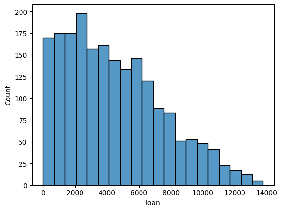

# Função `histplot`

A função `histplot()` é uma função para criar um histograma, que é uma representação gráfica da distribuição de frequência de uma variável numérica.

**Sintaxe:**

```python
seaborn.histplot(data, x=None, bins='auto', kde=False, color=None)
```

**Parâmetros principais:**

- **data:** Obrigatório. O DataFrame ou conjunto de dados que contém a variável numérica a ser plotada no histograma.

- **x:** Opcional. Especifica a variável numérica a ser plotada no eixo x. Se não fornecido, o histograma será plotado com base em `data`.

- **bins:** Opcional. Especifica a quantidade de bins (intervalos) a serem usados no histograma. Pode ser um número inteiro, uma sequência de valores representando os limites dos bins ou a string 'auto', que usa uma heurística para determinar automaticamente os bins.

- **kde:** Opcional. Se True, adiciona uma estimativa da função de densidade do kernel ao histograma, produzindo um gráfico de densidade.

- **color:** Opcional. Especifica a cor do histograma.

**Exemplo:**

```python
import seaborn as sns
import matplotlib.pyplot as plt

# Criando um DataFrame de exemplo
base_credit = pd.read_csv("./assets/credit_data.csv")

# Plotando o histograma para a coluna "loan"
sns.histplot(x = base_credit["loan"]);
```

**Saída:**



A função `histplot()` é muito útil para visualizar a distribuição de dados numéricos e identificar padrões, outliers e tendências nos dados. Ela é amplamente utilizada em análise exploratória de dados e na compreensão da distribuição dos dados em um conjunto de dados. A opção `kde=True` pode ser útil para sobrepor uma estimativa de densidade suavizada ao histograma, o que pode fornecer insights adicionais sobre a distribuição dos dados.