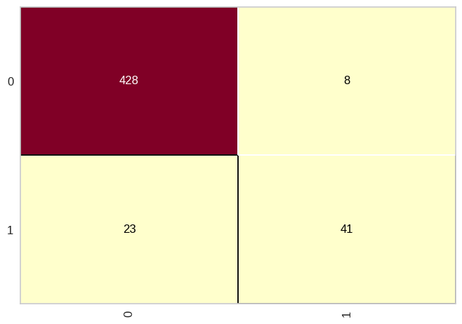

# Classe "Confusion Matrix"

A `ConfusionMatrix` é uma visualização do Yellowbrick, uma biblioteca para visualização de análises de aprendizado de máquina em Python. A classe `ConfusionMatrix` permite **criar e visualizar a matriz de confusão** para avaliar o desempenho de modelos de classificação.

### **Sintaxe**

```python
from yellowbrick.classifier import ConfusionMatrix

# Criar a visualização
cm = ConfusionMatrix(model)

# Ajustar o modelo e criar a matriz de confusão
cm.fit(X_train, y_train)

# Visualizar a matriz de confusão
cm.score()
```

**Parâmetros:**

- `model`: O estimador (modelo) do Scikit-learn que implementa o algoritmo de classificação. Por exemplo, pode ser um objeto de uma das classes como `GaussianNB`, `LogisticRegression`, `RandomForestClassifier`, entre outros.

- `X_train`: Array-like ou matriz esparsa de formato (n_samples, n_features) que representa os dados de treinamento.

- `y_train`: Array-like ou lista que contém as classes alvo (rótulos) das amostras de treinamento.

### **Exemplo**

```python
from yellowbrick.classifier import ConfusionMatrix
from sklearn.naive_bayes import GaussianNB

# Carregar o conjunto de dados
with open("credit.pkl", "rb") as file:
    X_credit_train, y_credit_train, X_credit_test, y_credit_test = pickle.load(file)

# Criar o modelo Naive Bayes Gaussiano
naive_credit_data = GaussianNB()
naive_credit_data.fit(X_credit_train, y_credit_train)

# Criar a visualização da matriz de confusão
cm = ConfusionMatrix(naive_credit_data)

# Ajustar o modelo e criar a matriz de confusão
cm.fit(X_credit_train, y_credit_train)

# Visualizar a matriz de confusão
cm.score(X_credit_test, y_credit_test)
```

**Saída:**



Neste exemplo, estamos usando o conjunto de dados de risco de crédito, onde estamos treinando um modelo de Naive Bayes Gaussiano e visualizando a matriz de confusão para avaliar o desempenho do modelo em um conjunto de teste.

### **Conclusão**

A visualização da matriz de confusão é uma ferramenta importante para avaliar o desempenho de modelos de classificação e entender os erros e acertos em cada classe. O Yellowbrick facilita a criação e visualização da matriz de confusão, permitindo uma análise mais detalhada do desempenho do modelo de classificação.
